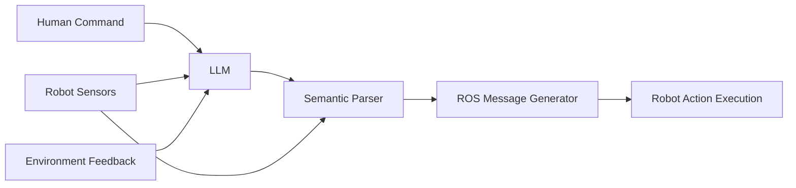

# Large Language Models for Robot Control

## Introduction to LLM Integration

Large Language Models (LLMs) have emerged as powerful tools for enabling natural human-robot interaction. When integrated with robotic systems, LLMs can transform high-level natural language commands into executable robot behaviors. This chapter explores the integration of LLMs with robotic systems, focusing on how these models can serve as intelligent interfaces between human intentions and robot actions.

## Role of LLMs in Robotics

### Natural Language Interface

LLMs serve as natural language interfaces that bridge human communication and robotic action. Rather than requiring users to understand robot programming languages or complex interfaces, LLMs enable people to communicate with robots using everyday language.

### High-Level Task Planning

LLMs excel at decomposing complex tasks into simpler subtasks. When given a high-level command like "Set the table for dinner," an LLM can break this down into concrete steps such as "retrieve plates," "place plates on table," "retrieve forks," etc.

### Knowledge Integration

Unlike traditional rule-based systems, LLMs contain vast amounts of world knowledge that can inform robot behavior. This knowledge helps robots understand object affordances, task relationships, and environmental contexts.

## LLM Integration Architecture

### The LLM-ROS Bridge

The integration of LLMs with robotic systems typically involves creating a bridge between the language model and the robot's control system. In ROS 2 environments, this bridge translates natural language commands into ROS 2 messages, services, and actions.



### System Architecture

The typical LLM-robot integration architecture includes:

1. **Language Processing Module**: Interfaces with the LLM and processes natural language inputs
2. **Semantic Parser**: Translates language into structured representations the robot understands
3. **Action Planner**: Generates robot action sequences based on parsed commands
4. **Execution Monitor**: Tracks execution progress and provides feedback
5. **Knowledge Base**: Stores robot-specific information and learned experiences

## Practical Implementation

### LLM Selection for Robotics

Not all LLMs are equally suitable for robotics applications. Key considerations include:

- **Latency**: Robotics applications often require low-latency responses
- **Control**: Some applications need fine-grained control over LLM outputs
- **Customization**: Ability to fine-tune or provide custom knowledge
- **Resource Requirements**: Computational constraints on robotic platforms
- **Reliability**: Consistent behavior for safety-critical applications

Popular choices for robotics include:
- **OpenAI GPT models** for cloud-based applications
- **Anthropic Claude** for safer, more controllable responses
- **Open-source models** like Llama for on-premise deployment
- **Specialized models** trained specifically for robotics tasks

### ROS 2 Integration Patterns

When integrating LLMs with ROS 2, several patterns emerge:

#### 1. Command Translation Pattern
```python
import rclpy
from std_msgs.msg import String
from rclpy.node import Node

class LLMCommandTranslator(Node):
    def __init__(self):
        super().__init__('llm_command_translator')
        self.subscription = self.create_subscription(
            String,
            'natural_language_commands',
            self.command_callback,
            10)
        self.publisher = self.create_publisher(String, 'robot_commands', 10)
        # Initialize your LLM connection here
        
    def command_callback(self, msg):
        # Process natural language command with LLM
        robot_command = self.llm_process(msg.data)
        # Publish translated robot command
        robot_msg = String()
        robot_msg.data = robot_command
        self.publisher.publish(robot_msg)
```

#### 2. Semantic Action Planning Pattern
```python
class SemanticActionPlanner:
    def __init__(self):
        # Initialize LLM and action library
        pass
    
    def plan_actions(self, natural_language_goal: str, current_state: dict):
        # Use LLM to create action plan
        prompt = self.create_plan_prompt(natural_language_goal, current_state)
        action_plan = self.query_llm(prompt)
        return self.parse_actions(action_plan)
    
    def create_plan_prompt(self, goal: str, state: dict):
        # Create prompt that includes current robot state
        # and environmental context
        prompt = f"""
        The robot is in state: {state}
        The human wants: {goal}
        
        Create a detailed action plan with specific steps.
        Each step should be executable by the robot.
        """
        return prompt
```

## Challenges and Solutions

### Ambiguity Resolution

Natural language commands often contain ambiguities that robots must resolve. For example, "pick up the cup" doesn't specify which of multiple cups. Solutions include:

1. **Context Grounding**: Using visual information to disambiguate references
2. **Active Inquiry**: Asking follow-up questions when ambiguity exists
3. **Probabilistic Interpretation**: Choosing the most likely interpretation based on context

### Robustness Considerations

LLMs can generate inconsistent or incorrect outputs. Robust integration requires:

- **Output Validation**: Checking that LLM outputs are executable
- **Fallback Handlers**: Responding gracefully to LLM failures
- **Consistency Monitoring**: Detecting and correcting inconsistent behavior

### Safety and Control

Critical robotic applications require safety guarantees even with LLM control:

- **Action Filtering**: Preventing execution of unsafe commands
- **Human Oversight**: Maintaining ability for human intervention
- **Safe Exploration**: Allowing safe exploration of LLM-generated actions

## Advanced Integration Techniques

### Chain-of-Thought Reasoning

LLMs can be prompted to think through complex tasks before providing outputs. This approach helps with complex robotic commands:

```
Instruction: "Go to the kitchen, find an apple, and bring it to me."

Chain-of-Thought:
1. The robot needs to navigate to the kitchen
2. In the kitchen, it needs to identify an apple among other objects
3. The robot needs to grasp the apple
4. The robot needs to return to the user
5. The robot needs to present the apple to the user
Each step should be translated to specific robot actions.
```

### Tool Usage Integration

Modern LLMs can be taught to "use tools" by calling external functions. In robotics, these tools can include:

- Perception services (object detection, scene analysis)
- Navigation services (path planning, obstacle avoidance)
- Manipulation services (grasp planning, motion execution)
- Knowledge retrieval services (object databases, task libraries)

## Case Study: LLM-Controlled Mobile Manipulation

Let's consider a practical example of an LLM controlling a mobile manipulator:

1. **User Command**: "Can you bring me the blue water bottle from the office?"
2. **LLM Processing**: The model analyzes the command, identifying:
   - The object: "blue water bottle"
   - The location: "office"
   - The task: "bring to user"
3. **Action Sequence**:
   - Navigate to the office
   - Search for blue water bottles
   - Plan grasp for the identified bottle
   - Execute grasp
   - Navigate back to user
   - Release object near user

4. **Execution**: The LLM output drives a task planner that executes these steps.

## Evaluation Metrics

### Functional Metrics

- **Task Success Rate**: Percentage of commands successfully executed
- **Command Interpretation Accuracy**: How often the LLM correctly interprets commands
- **Response Latency**: Time from command to action initiation
- **Recovery Rate**: Ability to handle and recover from failures

### Interaction Quality Metrics

- **Naturalness**: How natural the robot's responses feel
- **Helpfulness**: How effectively the robot assists the user
- **Predictability**: How consistent and predictable the robot behavior is
- **Error Handling**: How well the robot deals with misunderstandings

## Ethical Considerations

### Transparency

Users should understand the robot's limitations and when LLM interpretation might fail. Providing explanations for robot behavior helps build trust and appropriate expectations.

### Bias and Fairness

LLMs can exhibit biases that affect robot behavior. Careful consideration must be given to ensuring fair treatment across different users and contexts.

### Privacy

Robot systems with LLM integration may send data to cloud services. Clear policies and protections for user privacy are essential.

## Future Directions

### Continual Learning

Future VLA systems will incorporate continual learning from interactions, improving over time based on success and failure experiences.

### Multimodal Integration

Advancing beyond text-only LLM integration to include visual and other sensory information directly in language processing.

### Collaborative Intelligence

Systems that combine human and AI intelligence for more effective task execution.

## Implementation Best Practices

1. **Start Simple**: Begin with basic command mappings before advancing to complex reasoning
2. **Maintain Safety**: Ensure all LLM outputs pass safety checks
3. **Provide Feedback**: Keep users informed about the robot's understanding and plans
4. **Handle Failures Gracefully**: Have robust error handling and recovery mechanisms
5. **Validate Outputs**: Always validate that LLM actions are appropriate for the environment

## Summary

LLM integration with robotics opens new possibilities for natural human-robot interaction. However, successful implementation requires careful attention to safety, robustness, and user experience. By thoughtfully integrating LLMs with robotic systems, we can create robots that are more accessible, capable, and helpful to users without requiring technical expertise.

The bridge between natural language and robotic action requires not just translating words to commands, but truly understanding the intent behind human language in the context of the physical world.