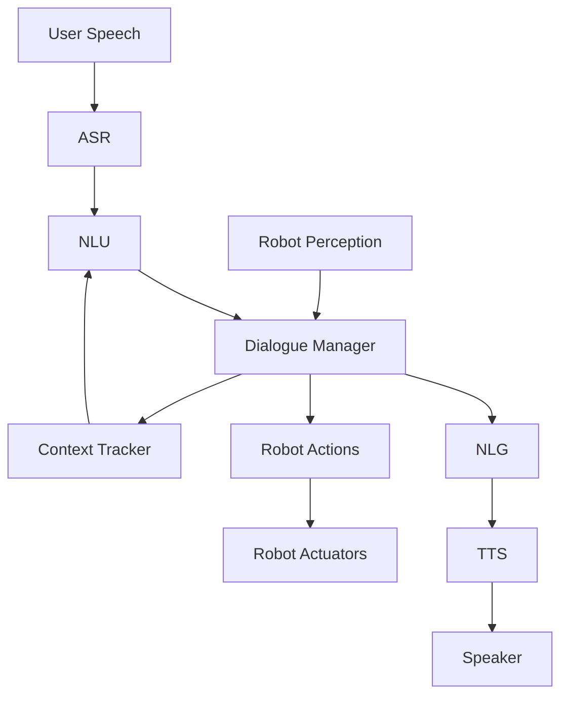

# Conversational Robotics for Humanoid Agents

## Introduction to Conversational Robotics

Conversational robotics represents a paradigm shift in human-robot interaction, moving beyond simple command-response patterns to natural, multi-turn dialogues. In humanoid robotics, conversational capabilities are particularly important as they enable robots to interact in ways that feel natural and intuitive to humans. This chapter explores the design, implementation, and deployment of conversational systems for humanoid robots.

## Principles of Conversational AI for Robotics

### Natural Language Understanding in Context

Conversational robots must understand language within the context of:
- Physical environment
- Current task
- Previous interactions
- User preferences and history
- Social context and norms

This contextual understanding is crucial for humanoid robots that operate in dynamic environments alongside humans.

### Turn-Taking and Dialogue Flow

Effective conversational robots follow natural turn-taking patterns:
- Recognizing when to speak and when to listen
- Managing interruptions gracefully
- Handling overlapping speech
- Maintaining coherent dialogue flow

### Multimodal Communication

Humanoid robots can communicate through multiple modalities:
- Spoken language
- Gestures and body language
- Facial expressions
- Eye contact and gaze
- Proxemics (spatial positioning)

Integrating these modalities enhances the conversational experience.

## Architecture for Conversational Robots

### Dialogue System Components

A complete conversational robotics system includes:

1. **Automatic Speech Recognition (ASR)**: Converts speech to text
2. **Natural Language Understanding (NLU)**: Interprets the meaning of text
3. **Dialogue Manager**: Determines the appropriate response strategy
4. **Natural Language Generation (NLG)**: Creates natural-sounding responses
5. **Speech Synthesis**: Converts text to speech
6. **Embodied Behavior Generation**: Coordinates robot actions with speech



### Context Management

Conversational systems must maintain multiple types of context:

- **Discourse Context**: Current topic and conversation history
- **Task Context**: Ongoing task and its state
- **Spatial Context**: Robot and human locations
- **Temporal Context**: Timing and sequencing of events
- **Social Context**: Relationship and social norms

## Implementation Approaches

### Template-Based Systems

Simple systems use predefined templates for common interactions:

```python
class TemplateBasedDialogueManager:
    def __init__(self):
        self.templates = {
            'greeting': ["Hello! How can I assist you today?", "Hi there! What would you like me to do?"],
            'acknowledgment': ["I understand you said: {input}", "Got it, {input}"],
            'confirmation': ["Did you mean I should {action}?", "Should I proceed with {action}?"]
        }
    
    def generate_response(self, user_input, intent, context):
        if intent in self.templates:
            template = random.choice(self.templates[intent])
            return template.format(input=user_input, action=context.get('action'))
        else:
            return "I'm not sure how to respond to that."
```

### Rule-Based Systems

More sophisticated systems use logical rules to guide conversations:

```python
class RuleBasedDialogueManager:
    def __init__(self):
        self.rules = [
            {'condition': lambda u, c: 'hello' in u.lower(), 
             'action': lambda u, c: "Hello! How can I help you?"},
            {'condition': lambda u, c: any(word in u.lower() for word in ['move', 'go', 'navigate']),
             'action': self.handle_navigation_request},
            {'condition': lambda u, c: any(word in u.lower() for word in ['grasp', 'pick', 'take']),
             'action': self.handle_manipulation_request}
        ]
    
    def generate_response(self, user_input, context):
        for rule in self.rules:
            if rule['condition'](user_input, context):
                return rule['action'](user_input, context)
        return "I'm not sure I understood that. Could you clarify?"
    
    def handle_navigation_request(self, user_input, context):
        # Extract destination from user input
        destination = self.extract_destination(user_input)
        return f"I'll navigate to the {destination} for you."
    
    def handle_manipulation_request(self, user_input, context):
        # Extract object from user input
        obj = self.extract_object(user_input)
        return f"I'll pick up the {obj} for you."
```

### Neural Approaches

Modern conversational systems often employ neural architectures:

#### Encoder-Decoder Architecture
```python
import torch
import torch.nn as nn

class NeuralDialogueSystem(nn.Module):
    def __init__(self, vocab_size, embed_dim, hidden_dim):
        super().__init__()
        self.embedding = nn.Embedding(vocab_size, embed_dim)
        self.encoder = nn.GRU(embed_dim, hidden_dim, batch_first=True)
        self.decoder = nn.GRU(embed_dim, hidden_dim, batch_first=True)
        self.output_projection = nn.Linear(hidden_dim, vocab_size)
        
    def forward(self, user_input, context=None):
        embedded_input = self.embedding(user_input)
        encoded, hidden = self.encoder(embedded_input)
        
        # If context available, integrate it with hidden state
        if context is not None:
            hidden = self.integrate_context(hidden, context)
        
        # Generate response
        output_embedded = self.embedding(torch.zeros_like(user_input))  # Start with SOS token
        decoded, _ = self.decoder(output_embedded, hidden)
        output = self.output_projection(decoded)
        
        return output
```

#### Transformer-Based Systems
```python
from transformers import AutoTokenizer, AutoModelForCausalLM

class TransformerBasedDialogue:
    def __init__(self, model_name="microsoft/DialoGPT-medium"):
        self.tokenizer = AutoTokenizer.from_pretrained(model_name)
        self.model = AutoModelForCausalLM.from_pretrained(model_name)
        
    def generate_response(self, user_input, conversation_history=None):
        if conversation_history:
            prompt = f"{conversation_history}\nUser: {user_input}\nRobot:"
        else:
            prompt = f"User: {user_input}\nRobot:"
            
        inputs = self.tokenizer.encode(prompt, return_tensors='pt')
        
        with torch.no_grad():
            outputs = self.model.generate(
                inputs, 
                max_length=inputs.shape[1] + 50,
                num_return_sequences=1,
                pad_token_id=self.tokenizer.eos_token_id
            )
        
        response = self.tokenizer.decode(outputs[0], skip_special_tokens=True)
        
        # Extract just the robot's response part
        if "Robot:" in response:
            robot_response = response.split("Robot:")[-1].strip()
        else:
            robot_response = response[len(prompt):].strip()
            
        return robot_response
```

## Conversational Patterns for Robotics

### Command Interpretation

Conversational robots must handle various command formulations:

```python
class CommandInterpreter:
    def __init__(self):
        self.patterns = {
            'navigation': [
                r'go to (.+)',
                r'move to (.+)', 
                r'navigate to (.+)',
                r'take me to (.+)'
            ],
            'manipulation': [
                r'pick up (.+)',
                r'grasp (.+)',
                r'get (.+)',
                r'take (.+)'
            ],
            'information': [
                r'what is (.+)',
                r'tell me about (.+)',
                r'how many (.+)',
                r'where is (.+)'
            ]
        }
    
    def parse_intent(self, user_input):
        for intent, patterns in self.patterns.items():
            for pattern in patterns:
                match = re.search(pattern, user_input.lower())
                if match:
                    return intent, match.group(1)
        return 'unknown', user_input
```

### Clarification and Disambiguation

Robots should handle ambiguous requests gracefully:

```python
class ClarificationHandler:
    def needs_clarification(self, parsed_command):
        # Check for ambiguous elements in the command
        entities = self.extract_entities(parsed_command)
        return any(self.is_ambiguous(entity) for entity in entities)
    
    def generate_clarification_request(self, parsed_command):
        entities = self.extract_entities(parsed_command)
        ambiguous_entities = [e for e in entities if self.is_ambiguous(e)]
        
        if len(ambiguous_entities) == 1:
            return f"Which {ambiguous_entities[0]} did you mean?"
        else:
            return f"I'm not sure which of these items you mean: {', '.join(ambiguous_entities)}. Could you clarify?"
    
    def is_ambiguous(self, entity):
        # Check if entity refers to multiple possible objects in environment
        possible_matches = self.find_objects_in_environment(entity)
        return len(possible_matches) > 1
```

### Error Recovery and Repair

Conversational systems need to handle and recover from errors:

```python
class ErrorRecoveryManager:
    def __init__(self):
        self.recovery_strategies = [
            self.rephrase_request,
            self.ask_for_alternative,
            self.offer_similar_actions,
            self.transfer_to_human
        ]
    
    def handle_error(self, error_type, current_state):
        for strategy in self.recovery_strategies:
            response = strategy(error_type, current_state)
            if response:
                return response
        return "I'm sorry, I'm having trouble helping with this. Would you like me to transfer you to a human assistant?"
    
    def rephrase_request(self, error_type, current_state):
        # Suggest rephrasing if the error was due to miscommunication
        if error_type == 'misunderstanding':
            return "I didn't quite understand that. Could you rephrase your request?"
        return None
    
    def ask_for_alternative(self, error_type, current_state):
        # Suggest alternative ways to accomplish the goal
        if error_type == 'action_failed':
            return "I tried that but couldn't complete it. Is there another way I could help you?"
        return None
```

## Embodied Conversations

Humanoid robots can enhance conversations through:

### Non-verbal Cues

- **Gestures**: Pointing, beckoning, indicating
- **Facial expressions**: Smiling, nodding, showing confusion
- **Eye contact**: Looking at speakers, gaze following
- **Body posture**: Leaning forward in engagement

### Spatial Awareness

- Positioning appropriately for interaction
- Respecting personal space
- Moving to better communication positions
- Coordinating movement with speech

## Social Interaction Protocols

### Turn Management

Conversational robots follow turn-taking norms:

- Recognizing when humans begin speaking
- Waiting appropriate pauses before responding
- Using back-channels to show attention ("uh-huh", "okay")
- Allowing for natural interruptions

### Politeness and Social Norms

- Using appropriate titles and honorifics
- Thanking users for requests
- Apologizing when unable to comply
- Offering alternatives when refusing requests

### Personalization

Adapting to individual users:
- Learning names and preferences
- Adjusting formality level
- Remembering past interactions
- Adapting to communication style

## Evaluation of Conversational Systems

### Objective Metrics

- **Task completion rate**: Percentage of tasks successfully completed
- **Dialogue length**: Average turns per successful completion
- **Misunderstanding rate**: Frequency of misinterpreted inputs
- **Recovery success**: Rate of successful error recovery

### Subjective Metrics

- **Naturalness**: How natural the interaction feels
- **Usability**: Ease of communicating with the robot
- **Trust**: User trust in the robot's responses
- **Satisfaction**: Overall interaction satisfaction

## Challenges in Conversational Robotics

### Real-time Processing

Conversational systems must operate in real-time, requiring efficient processing and response generation.

### Noise and Audio Quality

Robots often operate in noisy environments, challenging ASR systems.

### Multilingual Support

Supporting multiple languages and dialects for broader applicability.

### Cultural Sensitivity

Adapting to cultural norms for different populations and regions.

## Advanced Topics

### Multimodal Integration

Combining speech, vision, and action for richer interactions:

```python
class MultimodalDialogueManager:
    def __init__(self):
        self.speech_processor = SpeechProcessor()
        self.vision_processor = VisionProcessor()
        self.action_executor = ActionExecutor()
    
    def process_multimodal_input(self, speech_input, gesture_input, visual_input):
        # Process multiple input modalities simultaneously
        speech_interpretation = self.speech_processor.interpret(speech_input)
        gesture_interpretation = self.vision_processor.interpret_gesture(gesture_input)
        scene_interpretation = self.vision_processor.analyze_scene(visual_input)
        
        # Fuse interpretations across modalities
        fused_interpretation = self.fuse_modalities(
            speech_interpretation,
            gesture_interpretation,
            scene_interpretation
        )
        
        # Generate appropriate multimodal response
        return self.generate_response(fused_interpretation)
```

### Learning from Interaction

Systems that improve through experience:

- Reinforcement learning from successful interactions
- Learning new words and concepts from conversation
- Adapting dialogue strategies based on user feedback
- Building shared mental models with users

## Implementation Considerations

### Privacy and Ethics

Conversational robots often hear and process private information, requiring careful attention to privacy protection and ethical considerations.

### Safety and Security

Natural language interfaces can potentially be manipulated in unsafe ways, requiring safeguards against harmful commands.

### Scalability

As conversation complexity grows, systems must remain responsive and reliable.

## Future Directions

### Lifelong Learning

Future conversational robots will continuously learn and adapt from their interactions, becoming more personalized and capable over time.

### Social Robots

Conversational robots that serve as social companions, caregivers, or assistants.

### Collaborative AI

Systems where robots and humans work together in conversation-guided collaboration.

## Best Practices

1. **Start Simple**: Begin with limited domains and expand gradually
2. **Prioritize Safety**: Ensure all interactions are safe and controlled
3. **Design for Fallbacks**: Plan for system failures gracefully
4. **Test Thoroughly**: Test with diverse users and scenarios
5. **Consider Privacy**: Protect user information and interactions
6. **Iterative Design**: Continuously improve based on user feedback

## Summary

Conversational robotics enables natural, intuitive human-robot interaction that is particularly appropriate for humanoid systems. Success requires integrating speech, vision, and action systems while following social interaction norms. Effective conversational robots can significantly enhance the usability and acceptance of humanoid robotic systems.

The key to successful conversational robotics lies in creating systems that feel natural and helpful while maintaining safety and reliability. As these systems evolve, they will become increasingly important for practical deployment of humanoid robots in human environments.