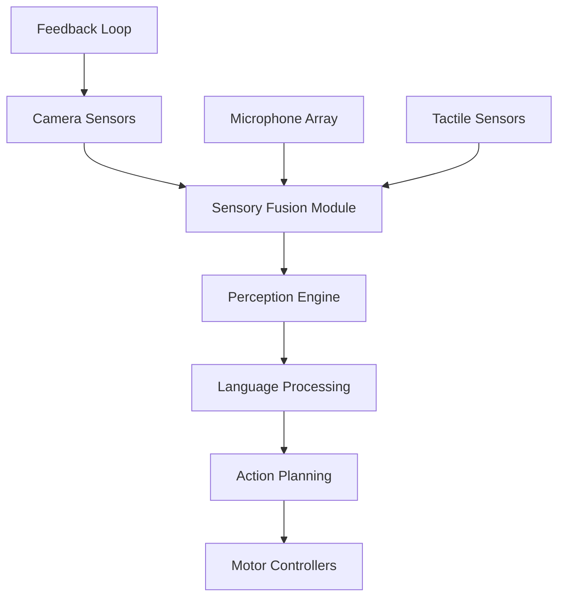

# Multimodal Learning for Robotics

## Introduction

Multimodal learning represents a paradigm shift in robotics education, where multiple sensory inputs are combined to enable more sophisticated and human-like interactions. This chapter explores the theoretical foundations and practical implementations of multimodal learning systems that integrate vision, language, and action capabilities in humanoid robotics.

## Understanding Multimodal Integration

### Theoretical Foundations

Multimodal learning in robotics involves the integration of different sensory modalities (vision, audio, tactile, proprioceptive) and cognitive domains (language, action planning). This integration enables robots to understand and interact with their environment more naturally and effectively.

Key components include:
- **Cross-modal correspondence**: Understanding relationships between different modalities
- **Multimodal embeddings**: Representations that capture information from multiple sources
- **Attention mechanisms**: Focus on relevant sensory inputs during decision-making
- **Grounded language understanding**: Connecting linguistic concepts with physical actions

### Benefits of Multimodal Learning

1. **Enhanced robustness**: Multiple sensor inputs provide redundancy
2. **Natural human-robot interaction**: More intuitive interfaces
3. **Improved context awareness**: Better understanding of complex environments
4. **Flexible task execution**: Ability to adapt based on available information

## Practical Implementation: Building a Multimodal Robot System

### Architecture Overview



### Implementation Steps

#### Step 1: Setting Up the Multimodal Framework

First, create the core structure for multimodal processing:

```typescript
// multiview_robot.ts
import { RobotController } from '../core/robot_controller';
import { VisionSystem } from './vision_system';
import { LanguageSystem } from './language_system';
import { ActionPlanner } from './action_planner';

export class MultimodalRobot {
  private robotController: RobotController;
  private visionSystem: VisionSystem;
  private languageSystem: LanguageSystem;
  private actionPlanner: ActionPlanner;

  constructor(robotController: RobotController) {
    this.robotController = robotController;
    this.visionSystem = new VisionSystem();
    this.languageSystem = new LanguageSystem();
    this.actionPlanner = new ActionPlanner();
  }

  async perceiveEnvironment(): Promise<MultimodalPerception> {
    // Integrate visual, auditory, and tactile inputs
    const visualData = await this.visionSystem.getVisualPerception();
    const auditoryData = await this.languageSystem.getAudioStream();
    const tactileData = await this.robotController.getCurrentTactileData();
    
    return this.integrateInputs(visualData, auditoryData, tactileData);
  }

  private integrateInputs(
    visual: VisionPerception,
    audio: AudioPerception,
    tactile: TactilePerception
  ): MultimodalPerception {
    // Implementation of cross-modal attention mechanism
    const fusion = new CrossModalFusion();
    return fusion.fuse([visual, audio, tactile]);
  }

  async interpretCommand(command: string): Promise<RobotActionPlan> {
    // Combine language understanding with environmental context
    const perceptualContext = await this.perceiveEnvironment();
    return this.actionPlanner.createPlan(command, perceptualContext);
  }

  async executeActionPlan(plan: RobotActionPlan): Promise<void> {
    // Execute the plan with feedback integration
    for (const action of plan.actions) {
      await this.robotController.executeAction(action);
      // Continuous monitoring and adjustment
      const updatedPerception = await this.perceiveEnvironment();
      if (action.requiresAdjustment(updatedPerception)) {
        const correction = this.actionPlanner.generateCorrection(action, updatedPerception);
        await this.robotController.executeAction(correction);
      }
    }
  }
}
```

#### Step 2: Vision System Implementation

```typescript
// vision_system.ts
import * as tf from '@tensorflow/tfjs-node';
import { CameraInterface } from '../interfaces/camera_interface';

export class VisionSystem {
  private camera: CameraInterface;
  private visionModel: tf.GraphModel;
  private attentionMechanism: AttentionMechanism;

  constructor() {
    this.camera = new CameraInterface();
    this.loadVisionModel();
    this.attentionMechanism = new AttentionMechanism();
  }

  async getVisualPerception(): Promise<VisionPerception> {
    const frame = await this.camera.captureFrame();
    
    // Process the frame through the vision model
    const visionEmbedding = this.processFrame(frame);
    
    // Apply attention to focus on relevant objects
    const attendedObjects = this.attentionMechanism.apply(visionEmbedding);
    
    return {
      timestamp: Date.now(),
      objects: attendedObjects,
      sceneDescription: this.describeScene(attendedObjects),
      spatialRelationships: this.extractSpatialRelationships(attendedObjects),
      affordances: this.extractAffordances(attendedObjects)
    };
  }

  private async processFrame(frame: ImageFrame): Promise<tf.Tensor> {
    // Preprocess the image
    const processed = tf.browser.fromPixels(frame)
      .resizeNearestNeighbor([224, 224])
      .expandDims(0)
      .toFloat()
      .div(tf.scalar(255));
    
    // Run through vision model
    const embedding = this.visionModel.predict(processed) as tf.Tensor;
    return embedding.squeeze();
  }

  private describeScene(objects: PerceivedObject[]): string {
    // Generate natural language description of the scene
    const objectNames = objects.map(obj => obj.name).join(', ');
    const spatialRelations = this.extractSpatialRelationships(objects);
    
    let description = `The scene contains: ${objectNames}. `;
    
    // Add spatial relationships
    for (const relation of spatialRelations) {
      description += `${relation.description} `;
    }
    
    return description.trim();
  }

  private extractSpatialRelationships(objects: PerceivedObject[]): SpatialRelation[] {
    const relations: SpatialRelation[] = [];
    
    for (let i = 0; i < objects.length; i++) {
      for (let j = i + 1; j < objects.length; j++) {
        const distance = this.calculateDistance(objects[i], objects[j]);
        const direction = this.calculateDirection(objects[i], objects[j]);
        
        if (distance < 0.5) { // 50cm threshold
          relations.push({
            source: objects[i],
            target: objects[j],
            distance,
            direction,
            description: `${objects[i].name} is ${direction} of ${objects[j].name}`
          });
        }
      }
    }
    
    return relations;
  }

  private extractAffordances(object: PerceivedObject): Affordance[] {
    // Determine what actions are possible with this object
    const affordances: Affordance[] = [];
    
    // Based on object type, extract possible affordances
    switch (object.type) {
      case 'graspable':
        affordances.push({ type: 'grasp', confidence: object.confidence });
        break;
      case 'movable':
        affordances.push({ type: 'move', confidence: object.confidence });
        break;
      case 'pressable':
        affordances.push({ type: 'press', confidence: object.confidence });
        break;
      // Add more affordance types as needed
    }
    
    return affordances;
  }

  private async loadVisionModel(): Promise<void> {
    // Load pre-trained vision model
    this.visionModel = await tf.loadGraphModel('path/to/vision/model');
  }
}
```

#### Step 3: Language System Implementation

```typescript
// language_system.ts
import * as tf from '@tensorflow/tfjs-node';
import { VoiceRecognition } from '../interfaces/voice_recognition';

export class LanguageSystem {
  private voiceRecognition: VoiceRecognition;
  private languageModel: tf.GraphModel;
  private groundingModel: GroundingModel;

  constructor() {
    this.voiceRecognition = new VoiceRecognition();
    this.loadLanguageModels();
  }

  async getAudioStream(): Promise<AudioPerception> {
    const audioBuffer = await this.voiceRecognition.listen();
    const transcription = await this.voiceRecognition.transcribe(audioBuffer);
    
    return {
      timestamp: Date.now(),
      transcription: transcription.text,
      confidence: transcription.confidence,
      speakerIntent: await this.inferIntent(transcription.text),
      entities: this.extractEntities(transcription.text)
    };
  }

  async interpretCommand(command: string, context: MultimodalPerception): Promise<CommandInterpretation> {
    // Combine command with environmental context
    const embeddings = await this.encodeCommand(command);
    const contextualEmbeddings = await this.groundInContext(embeddings, context);
    
    // Generate interpretation based on grounded understanding
    return this.generateInterpretation(command, contextualEmbeddings);
  }

  private async encodeCommand(command: string): Promise<CommandEmbedding> {
    // Tokenize and encode the command
    const tokens = this.tokenize(command);
    const tensor = tf.tensor2d([tokens], [1, tokens.length]);
    
    const embedding = this.languageModel.predict(tensor) as tf.Tensor;
    return {
      tokens,
      embedding: embedding.arraySync(),
      attentionWeights: this.computeAttentionWeights(embedding)
    };
  }

  private async groundInContext(
    commandEmbedding: CommandEmbedding,
    context: MultimodalPerception
  ): Promise<GroundedEmbedding> {
    // Ground the command in the environmental context
    return this.groundingModel.ground(commandEmbedding, context);
  }

  private generateInterpretation(
    command: string,
    groundedEmbedding: GroundedEmbedding
  ): CommandInterpretation {
    // Parse the grounded command to extract meaning
    const intent = this.parseIntent(groundedEmbedding);
    const arguments = this.parseArguments(groundedEmbedding, command);
    
    return {
      intent,
      arguments,
      confidence: this.calculateConfidence(groundedEmbedding),
      explanation: this.explainInterpretation(intent, arguments)
    };
  }

  private extractEntities(text: string): Entity[] {
    // Extract named entities from text
    const entityRegex = /\b(?!the|a|an)\b[A-Z][a-z]*\b/g;
    const matches = text.match(entityRegex) || [];
    
    return matches.map(match => ({
      text: match,
      type: this.classifyEntityType(match),
      confidence: 0.9 // Simplified confidence calculation
    }));
  }

  private parseIntent(groundedEmbedding: GroundedEmbedding): Intent {
    // Determine the primary intent from the grounded embedding
    // Implementation depends on the specific intent classification model
    return {
      type: 'navigate',
      confidence: 0.85,
      parameters: {}
    };
  }

  private parseArguments(groundedEmbedding: GroundedEmbedding, command: string): Argument[] {
    // Extract specific arguments for the command
    const args: Argument[] = [];
    
    // Look for spatial references, object references, etc.
    // Implementation depends on NLP model capabilities
    
    return args;
  }

  private async loadLanguageModels(): Promise<void> {
    // Load pre-trained language models
    this.languageModel = await tf.loadGraphModel('path/to/language/model');
    this.groundingModel = new GroundingModel();
  }

  private tokenize(text: string): number[] {
    // Simple tokenization (real implementation would use proper tokenizer)
    const vocabulary = this.loadVocabulary();
    return text.toLowerCase().split(' ').map(word => vocabulary[word] || 0);
  }

  private loadVocabulary(): Record<string, number> {
    // Return a simple vocabulary mapping
    return {
      'go': 1,
      'to': 2,
      'the': 3,
      'red': 4,
      'box': 5,
      // ... more vocabulary entries
    };
  }
}
```

#### Step 4: Action Planning System

```typescript
// action_planner.ts
export class ActionPlanner {
  private robotCapabilities: RobotCapabilities;
  private motionPrimitives: MotionPrimitive[];

  constructor() {
    this.robotCapabilities = this.loadCapabilities();
    this.motionPrimitives = this.loadMotionPrimitives();
  }

  createPlan(command: string, perceptualContext: MultimodalPerception): RobotActionPlan {
    // Create a sequence of actions based on the command and context
    const interpretation = this.interpretCommand(command, perceptualContext);
    
    // Generate action plan based on interpretation
    const actions = this.generateActions(interpretation, perceptualContext);
    
    return {
      id: this.generatePlanId(),
      command,
      interpretation,
      actions,
      estimatedDuration: this.calculateDuration(actions),
      successCriteria: this.defineSuccessCriteria(interpretation)
    };
  }

  generateCorrection(baseAction: RobotAction, perceptualUpdate: MultimodalPerception): RobotAction {
    // Generate corrective action based on perceptual feedback
    const correctionType = this.determineCorrectionType(baseAction, perceptualUpdate);
    
    switch (correctionType) {
      case 'path_adjustment':
        return this.generatePathAdjustment(baseAction, perceptualUpdate);
      case 'force_adjustment':
        return this.generateForceAdjustment(baseAction, perceptualUpdate);
      case 'retry':
        return this.generateRetry(baseAction, perceptualUpdate);
      default:
        return baseAction;
    }
  }

  private generateActions(
    interpretation: CommandInterpretation,
    context: MultimodalPerception
  ): RobotAction[] {
    const actions: RobotAction[] = [];

    switch (interpretation.intent.type) {
      case 'navigate':
        actions.push(...this.planNavigation(interpretation, context));
        break;
      case 'manipulate':
        actions.push(...this.planManipulation(interpretation, context));
        break;
      case 'communicate':
        actions.push(...this.planCommunication(interpretation, context));
        break;
      // Add more intent types as needed
      default:
        actions.push(this.createDefaultAction(interpretation.intent));
    }

    return actions;
  }

  private planNavigation(
    interpretation: CommandInterpretation,
    context: MultimodalPerception
  ): RobotAction[] {
    // Plan navigation actions
    const destination = this.resolveDestination(interpretation.arguments, context);
    const path = this.planPath(destination, context);

    return [
      this.createAction('look_at', { target: destination }),
      this.createAction('plan_path', { path }),
      this.createAction('navigate', { path, destination }),
      this.createAction('arrive', { destination })
    ];
  }

  private planManipulation(
    interpretation: CommandInterpretation,
    context: MultimodalPerception
  ): RobotAction[] {
    // Plan manipulation actions
    const object = this.resolveObject(interpretation.arguments, context);
    const graspPose = this.calculateGraspPose(object);
    const manipulationPose = this.calculateManipulationPose(object);

    return [
      this.createAction('approach_object', { object, pose: object.center }),
      this.createAction('identify_grasp_point', { object }),
      this.createAction('grasp_object', { object, pose: graspPose }),
      this.createAction('manipulate_object', { object, target: manipulationPose }),
      this.createAction('release_object', { object })
    ];
  }

  private planCommunication(
    interpretation: CommandInterpretation,
    context: MultimodalPerception
  ): RobotAction[] {
    // Plan communication actions
    const response = this.generateResponse(interpretation, context);

    return [
      this.createAction('face_user', {}),
      this.createAction('generate_speech', { text: response }),
      this.createAction('speak', { text: response })
    ];
  }

  private resolveDestination(arguments: Argument[], context: MultimodalPerception): Pose3D {
    // Resolve destination based on command arguments and environmental context
    // This would involve parsing spatial references and matching them to objects in the environment

    // For example, if the command is "Go to the red box"
    // Find the red box in the environment and return its position
    for (const arg of arguments) {
      if (arg.type === 'location' || arg.type === 'object') {
        const object = context.objects.find(obj => 
          obj.name === arg.value || 
          obj.properties.some(prop => prop === arg.value)
        );
        
        if (object) {
          return object.pose;
        }
      }
    }

    // Default to some position if not found
    return { x: 0, y: 0, z: 0, roll: 0, pitch: 0, yaw: 0 };
  }

  private planPath(destination: Pose3D, context: MultimodalPerception): Waypoint[] {
    // Plan a path to the destination considering obstacles
    // This would use pathfinding algorithms like A*, RRT, etc.
    return [
      { x: 0, y: 0, z: 0 }, // Start
      destination // End
    ];
  }

  private createAction(type: ActionType, parameters: Record<string, any>): RobotAction {
    return {
      id: this.generateActionId(),
      type,
      parameters,
      successCriteria: this.defineActionSuccessCriteria(type),
      timeout: 30000, // 30 seconds default timeout
      priority: 1
    };
  }

  private loadCapabilities(): RobotCapabilities {
    // Define what the robot can do
    return {
      mobility: {
        degreesOfFreedom: 6,
        maxSpeed: 1.0,
        precision: 0.01
      },
      manipulation: {
        dof: 7,
        maxPayload: 5,
        precision: 0.001
      },
      communication: {
        speechSynthesis: true,
        gesture: true
      }
    };
  }

  private loadMotionPrimitives(): MotionPrimitive[] {
    // Load predefined motion patterns
    return [
      {
        name: 'reach',
        parameters: ['target_pose'],
        trajectory: 'straight_line_approach'
      },
      {
        name: 'grasp',
        parameters: ['grasp_type', 'force'],
        trajectory: 'pinch_grip'
      }
      // More motion primitives...
    ];
  }

  private generatePlanId(): string {
    return `plan_${Date.now()}_${Math.random().toString(36).substr(2, 9)}`;
  }

  private generateActionId(): string {
    return `action_${Date.now()}_${Math.random().toString(36).substr(2, 9)}`;
  }
}
```

### Training and Evaluation

#### Multimodal Dataset Preparation

```typescript
// dataset_builder.ts
export class MultimodalDatasetBuilder {
  private samples: MultimodalSample[] = [];

  async collectTrainingData(
    sessionCount: number,
    samplePerSession: number
  ): Promise<MultimodalDataset> {
    for (let i = 0; i < sessionCount; i++) {
      await this.collectSessionData(samplePerSession);
    }

    return this.buildDataset();
  }

  private async collectSessionData(count: number): Promise<void> {
    for (let i = 0; i < count; i++) {
      // Collect synchronized multimodal data
      const visualData = await this.visionSystem.getVisualPerception();
      const audioData = await this.languageSystem.getAudioStream();
      const tactileData = await this.getTactileData();
      const actionData = await this.getActionData();

      const sample: MultimodalSample = {
        timestamp: Date.now(),
        vision: visualData,
        audio: audioData,
        tactile: tactileData,
        action: actionData,
        context: this.getCurrentContext()
      };

      this.samples.push(sample);
    }
  }

  private buildDataset(): MultimodalDataset {
    return {
      samples: this.samples,
      metadata: {
        timestamp: Date.now(),
        sensorConfigurations: this.getSensorConfigurations(),
        environmentalConditions: this.getCurrentEnvironmentalConditions()
      },
      splits: this.splitIntoTrainValTest(this.samples)
    };
  }
}
```

#### Model Training Script

```bash
#!/bin/bash
# train_multimodal_model.sh

echo "Starting multimodal learning model training..."

# Set up training parameters
TRAINING_DATA_PATH="./data/multimodal_dataset.json"
MODEL_OUTPUT_PATH="./models/multimodal_model"
BATCH_SIZE=32
LEARNING_RATE=0.001
EPOCHS=100

# Train the model
python3 -m pip install torch torchvision torchaudio
python3 train_model.py \
  --data-path $TRAINING_DATA_PATH \
  --output-path $MODEL_OUTPUT_PATH \
  --batch-size $BATCH_SIZE \
  --learning-rate $LEARNING_RATE \
  --epochs $EPOCHS

echo "Training completed!"
```

### Evaluation Metrics

For multimodal learning systems, we evaluate using several key metrics:

1. **Cross-modal accuracy**: How well information from one modality matches another
2. **Integration effectiveness**: How well multimodal information improves performance compared to single modalities
3. **Robustness**: Performance under varying environmental conditions
4. **Latency**: Response time of the multimodal system
5. **Human-robot interaction quality**: Subjective measures of naturalness and effectiveness

## Advanced Topics in Multimodal Learning

### Transfer Learning Between Modalities

Multimodal systems can benefit significantly from transfer learning, where knowledge from one modality can be transferred to improve performance in another. For example, visual recognition capabilities can be leveraged to improve language understanding and vice versa.

```typescript
// cross_modal_transfer.ts
export class CrossModalTransfer {
  private sourceEncoder: tf.LayersModel;
  private targetEncoder: tf.LayersModel;
  private translator: tf.Sequential;

  constructor() {
    this.initializeModels();
  }

  async transferKnowledge(
    sourceModality: Modality,
    targetModality: Modality,
    sourceData: tf.Tensor
  ): Promise<tf.Tensor> {
    // Encode source data
    const sourceRepresentation = await this.sourceEncoder.predict(sourceData) as tf.Tensor;
    
    // Translate representation
    const translatedRepresentation = await this.translator.predict(sourceRepresentation) as tf.Tensor;
    
    // Decode to target modality
    return await this.targetEncoder.predict(translatedRepresentation) as tf.Tensor;
  }

  private async initializeModels(): Promise<void> {
    // Initialize encoder-decoder architecture
    this.sourceEncoder = await this.buildEncoder('source');
    this.targetEncoder = await this.buildEncoder('target');
    this.translator = await this.buildTranslator();
  }
}
```

### Active Learning Integration

Active learning can be used to improve multimodal systems by allowing the robot to request clarification when uncertain:

```typescript
// active_learning.ts
export class ActiveLearner {
  private uncertaintyThreshold: number = 0.7;

  async determineIfClarificationNeeded(
    commandInterpretation: CommandInterpretation
  ): Promise<boolean> {
    return commandInterpretation.confidence < this.uncertaintyThreshold;
  }

  generateClarificationRequest(
    commandInterpretation: CommandInterpretation,
    perceptualContext: MultimodalPerception
  ): ClarificationRequest {
    const ambiguousElements = this.identifyAmbiguousElements(commandInterpretation);
    
    return {
      query: `Could you clarify ${ambiguousElements.join(', ')}?`,
      options: this.generateDisambiguationOptions(ambiguousElements, perceptualContext),
      expectedAnswerFormat: 'selection_or_description'
    };
  }

  private identifyAmbiguousElements(interpretation: CommandInterpretation): string[] {
    // Identify elements with low confidence
    const ambiguous: string[] = [];
    
    if (interpretation.confidence < 0.5) {
      ambiguous.push('overall intent');
    }
    
    for (const arg of interpretation.arguments) {
      if (arg.confidence < 0.5) {
        ambiguous.push(arg.type);
      }
    }
    
    return ambiguous;
  }
}
```

### Handling Partial Observability

In real-world scenarios, robots often have partial observability of their environment. Multimodal systems can help address this challenge:

```typescript
// belief_state_estimator.ts
export class BeliefStateEstimator {
  private stateSpace: StateSpace;
  private observationModel: ObservationModel;
  private transitionModel: TransitionModel;

  estimateBeliefState(
    observations: MultimodalObservation[],
    actions: RobotAction[]
  ): BeliefState {
    // Start with prior belief
    let belief = this.priorBelief();
    
    // Update belief based on observations and actions
    for (let i = 0; i < observations.length; i++) {
      belief = this.updateBelief(
        belief,
        observations[i],
        actions[i] || null
      );
    }
    
    return belief;
  }

  private updateBelief(
    prevBelief: BeliefState,
    observation: MultimodalObservation,
    action: RobotAction | null
  ): BeliefState {
    // Predict new state based on action
    const predicted = this.transitionModel.propagate(prevBelief, action);
    
    // Update prediction with new observation
    const updated = this.observationModel.update(predicted, observation);
    
    return updated;
  }
}
```

## Conclusion

Multimodal learning represents a significant advancement in robotics, enabling more natural and effective human-robot interactions. Through the integration of vision, language, and action, robots can better understand and navigate complex environments. The implementation of such systems requires careful consideration of sensor integration, timing, and attention mechanisms, but offers substantial benefits in terms of robustness and capability.

Future developments in this field will likely focus on improving cross-modal reasoning, developing more sophisticated grounding mechanisms, and creating more natural forms of human-robot interaction that leverage the full spectrum of human communication modalities.

## Exercises

1. Implement a multimodal attention mechanism that prioritizes sensory inputs based on task relevance
2. Develop a cross-modal translation model for transferring information between vision and language
3. Create a multimodal dataset for a specific robotic task and train a model using it
4. Evaluate the performance of your multimimodal system under different environmental conditions
5. Design and implement an active learning component that requests clarification when uncertain