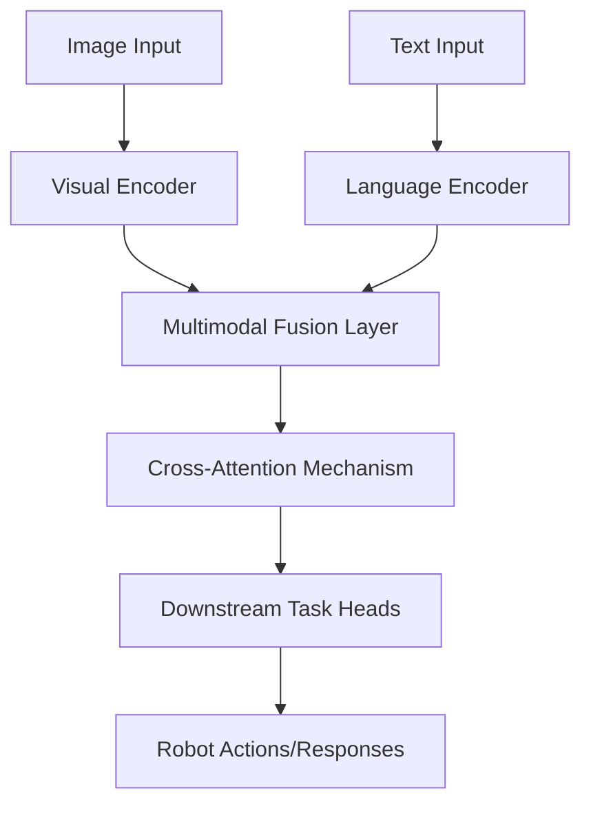

# Vision-Language Models (VLM) for Robotics

## Introduction

Vision-Language Models (VLMs) represent a significant advancement in artificial intelligence that combines visual understanding with language processing. In robotics, these models enable more intuitive human-robot interaction and complex task execution by understanding both visual scenes and linguistic instructions. This section covers the architecture, training methodologies, and practical applications of VLMs in robotics.

## Understanding Vision-Language Models

### Theoretical Foundation

Vision-Language Models are neural architectures designed to process both visual and textual information simultaneously. Unlike traditional approaches that process modalities separately, VLMs learn joint representations that capture the relationship between visual elements and language concepts.

Key characteristics include:
- **Cross-modal alignment**: The ability to understand corresponding elements across vision and language
- **Zero-shot capabilities**: Performing tasks without explicit training on that specific task
- **Multi-task learning**: Handling various tasks like captioning, question answering, and instruction following
- **Scalable architectures**: Large models that can handle diverse inputs

### Architecture Overview



## Practical Implementation of VLMs in Robotics

### Model Selection and Architecture

When implementing VLMs for robotics, selecting the appropriate architecture is crucial. Popular choices include:

1. **CLIP-style architectures**: Good for zero-shot recognition and understanding
2. **Flamingo-style architectures**: Effective for complex instruction following
3. **BLIP-style architectures**: Suited for image captioning and generation
4. **LLaVA-style architectures**: Combines vision and language capabilities effectively

### Implementation Steps

#### Step 1: Setting Up the Vision-Language Pipeline

First, let's create the core VLM integration for robotics:

```python
# vision_language_robot.py
import torch
import torch.nn as nn
from transformers import CLIPProcessor, CLIPModel
from PIL import Image
import numpy as np

class VisionLanguageRobot:
    def __init__(self, model_name="openai/clip-vit-large-patch14"):
        """
        Initialize the Vision-Language Robot system
        """
        self.processor = CLIPProcessor.from_pretrained(model_name)
        self.model = CLIPModel.from_pretrained(model_name)
        self.device = torch.device("cuda" if torch.cuda.is_available() else "cpu")
        self.model.to(self.device)
        
    def process_instruction(self, image, instruction):
        """
        Process visual input and linguistic instruction together
        """
        inputs = self.processor(
            text=[instruction],
            images=image,
            return_tensors="pt",
            padding=True
        ).to(self.device)
        
        with torch.no_grad():
            outputs = self.model(**inputs)
            
        return self.interpret_outputs(outputs, instruction)
    
    def interpret_outputs(self, outputs, instruction):
        """
        Interpret model outputs and generate robot actions
        """
        # Get similarity scores
        logits_per_image = outputs.logits_per_image
        probs = logits_per_image.softmax(dim=1)
        
        # Map to robot actions based on instruction
        action = self.map_to_action(instruction, probs)
        
        return {
            'action': action,
            'confidence': float(torch.max(probs)),
            'raw_probabilities': probs.detach().cpu().numpy().tolist()[0]
        }
    
    def map_to_action(self, instruction, probabilities):
        """
        Map the VLM output to specific robot actions
        """
        # This would be more sophisticated in practice
        # including NLU processing and action mapping
        
        if "go to" in instruction.lower() or "move to" in instruction.lower():
            return "NAVIGATE_TO_TARGET"
        elif "pick up" in instruction.lower() or "grasp" in instruction.lower():
            return "GRASP_OBJECT"
        elif "place" in instruction.lower() or "put" in instruction.lower():
            return "PLACE_OBJECT"
        else:
            return "STANDBY"
```

#### Step 2: Creating a VLM-Enhanced Perception System

```python
# vl_perception_system.py
import torch
from transformers import AutoProcessor, BlipForConditionalGeneration
import cv2
from PIL import Image

class VLPerceptionSystem:
    def __init__(self):
        """
        Initialize the Vision-Language Perception System
        """
        # Use BLIP for image captioning
        self.caption_processor = AutoProcessor.from_pretrained("Salesforce/blip-image-captioning-base")
        self.caption_model = BlipForConditionalGeneration.from_pretrained("Salesforce/blip-image-captioning-base")
        
        self.device = torch.device("cuda" if torch.cuda.is_available() else "cpu")
        self.caption_model.to(self.device)
        
    def describe_scene(self, image_array):
        """
        Generate a natural language description of the scene
        """
        image = Image.fromarray(cv2.cvtColor(image_array, cv2.COLOR_BGR2RGB))
        
        inputs = self.caption_processor(images=image, return_tensors="pt").to(self.device)
        
        with torch.no_grad():
            generated_ids = self.caption_model.generate(**inputs, max_length=50)
            caption = self.caption_processor.batch_decode(generated_ids, skip_special_tokens=True)[0]
        
        return caption
    
    def identify_objects(self, image_array, object_queries):
        """
        Identify specific objects in the scene using VLM
        """
        # This would use a more sophisticated object detection method
        # with vision-language grounding
        scene_description = self.describe_scene(image_array)
        
        # Simple keyword matching for demonstration
        found_objects = []
        for query in object_queries:
            if query.lower() in scene_description.lower():
                found_objects.append({
                    'name': query,
                    'description': scene_description,
                    'confidence': 0.8  # Simplified confidence
                })
        
        return found_objects
```

#### Step 3: Integrating VLM with Robot Control

```python
# vl_robot_controller.py
import numpy as np
from abc import ABC, abstractmethod

class RobotController(ABC):
    @abstractmethod
    def move_to_position(self, position):
        pass
    
    @abstractmethod
    def grasp_object(self, object_info):
        pass
    
    @abstractmethod
    def release_object(self):
        pass

class VLRobotController(RobotController):
    def __init__(self, vl_model, perception_system):
        self.vl_model = vl_model
        self.perception_system = perception_system
        self.current_task = None
        
    def execute_natural_language_command(self, command, current_image):
        """
        Execute command given in natural language
        """
        # Process the command with the VLM
        result = self.vl_model.process_instruction(current_image, command)
        
        # Execute the resulting action
        action = result['action']
        confidence = result['confidence']
        
        if confidence > 0.7:  # Confidence threshold
            return self.execute_action(action, command, current_image)
        else:
            return {
                'status': 'low_confidence',
                'suggestion': 'Please rephrase the command or provide clearer image',
                'confidence': confidence
            }
    
    def execute_action(self, action, command, current_image):
        """
        Execute specific robot action based on VLM interpretation
        """
        if action == "NAVIGATE_TO_TARGET":
            target_location = self.extract_target_location(command, current_image)
            return self.move_to_position(target_location)
        
        elif action == "GRASP_OBJECT":
            object_to_grasp = self.identify_object_for_grasping(command, current_image)
            return self.grasp_object(object_to_grasp)
        
        elif action == "PLACE_OBJECT":
            placement_location = self.determine_placement_location(command)
            return self.place_object(placement_location)
        
        else:
            return {'status': 'action_not_implemented', 'action': action}
    
    def extract_target_location(self, command, image):
        """
        Extract the target location from the command and image
        """
        # Use the perception system to understand the scene
        scene_description = self.perception_system.describe_scene(image)
        
        # Parse the command to understand the target
        # This would involve more sophisticated NLP in practice
        if "table" in command.lower():
            # Return a position associated with a table in the scene
            return self.locate_table_in_scene(scene_description)
        elif "shelf" in command.lower():
            return self.locate_shelf_in_scene(scene_description)
        else:
            # Default to a safe position
            return {'x': 0.5, 'y': 0.0, 'z': 0.0}
    
    def identify_object_for_grasping(self, command, image):
        """
        Identify which object to grasp based on the command
        """
        # Extract object name from command
        import re
        object_names = re.findall(r'\b(?:the|a|an)?\s+(\w+)', command.lower())
        
        # Use perception system to locate objects
        objects = self.perception_system.identify_objects(image, object_names)
        
        if objects:
            return objects[0]  # Return first found object
        else:
            return None
    
    def determine_placement_location(self, command):
        """
        Determine where to place an object based on command
        """
        if "on the table" in command.lower():
            return {'x': 0.6, 'y': 0.0, 'z': 0.8}  # On table coordinates
        elif "on the shelf" in command.lower():
            return {'x': 1.0, 'y': 0.0, 'z': 1.2}  # On shelf coordinates
        else:
            return {'x': 0.5, 'y': 0.0, 'z': 0.8}  # Default placement
    
    def locate_table_in_scene(self, scene_description):
        """
        Locate table in the scene based on description
        """
        # Simplified implementation
        # In practice, this would involve computer vision techniques
        return {'x': 0.6, 'y': 0.0, 'z': 0.0}
    
    def locate_shelf_in_scene(self, scene_description):
        """
        Locate shelf in the scene based on description
        """
        # Simplified implementation
        return {'x': 1.0, 'y': 0.0, 'z': 1.0}
    
    def move_to_position(self, position):
        """
        Move robot to the specified position
        """
        # Simulate movement
        print(f"Moving to position: {position}")
        return {'status': 'success', 'position': position}
    
    def grasp_object(self, object_info):
        """
        Grasp the identified object
        """
        if object_info:
            print(f"Grasping object: {object_info['name']}")
            return {'status': 'success', 'object': object_info['name']}
        else:
            return {'status': 'failure', 'reason': 'no_object_identified'}
    
    def place_object(self, location):
        """
        Place currently held object at location
        """
        print(f"Placing object at: {location}")
        return {'status': 'success', 'location': location}
```

#### Step 4: Creating a Demo Application

```python
# demo_vlm_robot.py
import cv2
import numpy as np

class VLDemoApplication:
    def __init__(self):
        """Initialize the VLM Robot Demo"""
        self.vl_model = VisionLanguageRobot()
        self.perception_system = VLPerceptionSystem()
        self.robot_controller = VLRobotController(self.vl_model, self.perception_system)
        
    def run_demo(self):
        """Run a demonstration of VLM capabilities"""
        print("Starting Vision-Language Model Robot Demo")
        
        # Simulated scenarios
        scenarios = [
            {
                "command": "Go to the red chair",
                "image_description": "A room with furniture including a red chair"
            },
            {
                "command": "Pick up the blue cup",
                "image_description": "A table with various objects including a blue cup"
            },
            {
                "command": "Place the object on the table",
                "image_description": "A robot holding an object near a table"
            }
        ]
        
        for i, scenario in enumerate(scenarios):
            print(f"\n--- Scenario {i+1}: {scenario['command']} ---")
            print(f"Simulated scene: {scenario['image_description']}")
            
            # Simulate image input (in a real system, this would come from robot cameras)
            simulated_image = self.generate_simulated_image(scenario['image_description'])
            
            # Execute the command
            result = self.robot_controller.execute_natural_language_command(
                scenario['command'], 
                simulated_image
            )
            
            print(f"Result: {result}")
    
    def generate_simulated_image(self, description):
        """
        Generate a simulated image based on description
        In a real system, this would be captured from robot cameras
        """
        # Create a dummy image (in RGB format)
        # Size 480x640 with random colors to simulate an image
        image = np.random.randint(0, 255, (480, 640, 3), dtype=np.uint8)
        
        # Add some text to indicate the description
        cv2.putText(image, description[:50], (10, 30), 
                   cv2.FONT_HERSHEY_SIMPLEX, 0.7, (255, 255, 255), 2)
        
        return image

# Example usage
if __name__ == "__main__":
    demo = VLDemoApplication()
    demo.run_demo()
```

#### Step 5: Advanced VLM Integration with Memory and Context

```python
# advanced_vlm_integration.py
import pickle
import os
from datetime import datetime

class VLMMemorySystem:
    def __init__(self, memory_size=100):
        """
        Maintain memory of previous interactions for contextual understanding
        """
        self.memory = []
        self.memory_size = memory_size
        self.current_context = {}
    
    def store_interaction(self, command, image, action_result):
        """
        Store an interaction for future reference
        """
        interaction = {
            'timestamp': datetime.now(),
            'command': command,
            'image_features': self.extract_visual_features(image),
            'action_result': action_result,
            'context': dict(self.current_context)
        }
        
        self.memory.append(interaction)
        
        # Limit memory size
        if len(self.memory) > self.memory_size:
            self.memory.pop(0)
    
    def extract_visual_features(self, image):
        """
        Extract key visual features from image
        In practice, this might use a pre-trained CNN
        """
        # Simplified feature extraction
        return {
            'dominant_colors': self.get_dominant_colors(image),
            'object_count': self.count_objects(image),
            'scene_type': self.classify_scene_type(image)
        }
    
    def get_dominant_colors(self, image):
        """Get dominant colors in the image"""
        # Simplified color extraction
        avg_color = np.mean(image, axis=(0, 1))
        return avg_color.tolist()
    
    def count_objects(self, image):
        """Count objects in the image (simplified)"""
        # In a real system, use object detection
        return 5  # Placeholder
    
    def classify_scene_type(self, image):
        """Classify scene type (simplified)"""
        # In a real system, use scene classification
        return "indoor"  # Placeholder
    
    def retrieve_context(self, current_command):
        """
        Retrieve relevant context from memory
        """
        # For simplicity, return the last interaction
        if self.memory:
            return self.memory[-1]
        return None

class AdvancedVLRobotController(VLRobotController):
    def __init__(self, vl_model, perception_system):
        super().__init__(vl_model, perception_system)
        self.memory_system = VLMMemorySystem()
    
    def execute_natural_language_command(self, command, current_image):
        """
        Execute command with memory and context considerations
        """
        # Retrieve relevant context
        previous_interaction = self.memory_system.retrieve_context(command)
        
        # Process command considering context
        result = self.vl_model.process_instruction(current_image, command)
        
        # Store the interaction for future reference
        self.memory_system.store_interaction(command, current_image, result)
        
        # Execute the action if confidence is high enough
        action = result['action']
        confidence = result['confidence']
        
        if confidence > 0.7:
            return self.execute_action(action, command, current_image)
        else:
            return {
                'status': 'low_confidence',
                'suggestion': 'Please rephrase the command or provide clearer image',
                'confidence': confidence
            }
```

### Training VLMs for Robotics Applications

#### Custom Dataset Preparation

```bash
#!/bin/bash
# prepare_vlm_dataset.sh

echo "Preparing Vision-Language dataset for robotics..."

# Create dataset structure
mkdir -p robotics_vlm_dataset/{train,val,test}/{images,text}

# Sample script to create a simple dataset format
cat > create_robotics_vlm_dataset.py << 'EOF'
import json
import os
import random

# Define sample data for robotics VLM training
sample_data = [
    {
        "image_id": "img_001",
        "image_path": "images/img_001.jpg",
        "instruction": "Navigate to the red box",
        "action": "NAVIGATE_TO_TARGET",
        "target_position": {"x": 0.5, "y": 0.2, "z": 0.0},
        "scene_description": "A room with a red box on the floor"
    },
    {
        "image_id": "img_002", 
        "image_path": "images/img_002.jpg",
        "instruction": "Pick up the blue cup",
        "action": "GRASP_OBJECT",
        "object_info": {"name": "blue cup", "position": {"x": 0.4, "y": 0.0, "z": 0.8}},
        "scene_description": "A table with a blue cup on it"
    },
    {
        "image_id": "img_003",
        "image_path": "images/img_003.jpg", 
        "instruction": "Place the object on the table",
        "action": "PLACE_OBJECT",
        "placement_position": {"x": 0.6, "y": 0.0, "z": 0.8},
        "scene_description": "Robot holding an object near a table"
    }
    # Add more samples...
]

# Save the dataset
os.makedirs("robotics_vlm_dataset/annotations", exist_ok=True)

with open("robotics_vlm_dataset/annotations/train.json", "w") as f:
    json.dump(sample_data, f, indent=2)

print("Dataset prepared successfully!")
print(f"Created {len(sample_data)} training samples")

# Create validation and test splits
val_test_split = sample_data.copy()
random.shuffle(val_test_split)

val_samples = val_test_split[:1]
test_samples = val_test_split[1:2]

with open("robotics_vlm_dataset/annotations/val.json", "w") as f:
    json.dump(val_samples, f, indent=2)

with open("robotics_vlm_dataset/annotations/test.json", "w") as f:
    json.dump(test_samples, f, indent=2)

print("Validation and test splits created.")
EOF

python3 create_robotics_vlm_dataset.py

echo "Dataset preparation completed!"