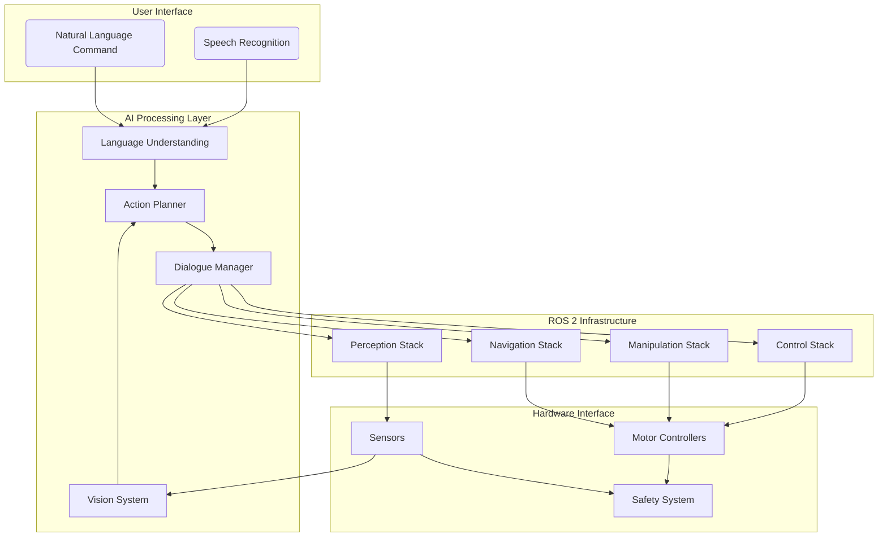

# Capstone Project: Physical AI & Humanoid Robotics Integration

## Course Capstone Overview

The capstone project represents the culmination of the entire Physical AI & Humanoid Robotics course. Students will design, implement, and demonstrate a complete humanoid robot system capable of receiving natural language commands, interpreting visual scenes, and executing complex tasks through coordinated action sequences. This project integrates knowledge from all previous chapters into a functioning physical AI system.

### Project Goals

The primary objectives of this capstone project are:

1. **Integration Mastery**: Demonstrate the ability to integrate vision, language, and action systems into a cohesive robotic platform
2. **Real-World Application**: Apply course concepts to solve practical robotics challenges
3. **System Design**: Design scalable, robust systems that can operate in real environments
4. **Evaluation Skills**: Develop expertise in evaluating and measuring system performance
5. **Documentation**: Create professional-quality documentation for complex systems

### Project Scope

Students will develop a humanoid robot system with the following capabilities:

- **Natural Language Understanding**: Interpret commands expressed in everyday language
- **Visual Scene Understanding**: Recognize objects, spatial relationships, and environmental context
- **Action Planning**: Generate and execute complex action sequences
- **Multimodal Integration**: Coordinate information from vision, language, and action systems
- **Safety Compliance**: Operate within safety guidelines and protocols

## Project Requirements

### Technical Requirements

#### Hardware Platform
The project assumes either a simulated humanoid robot (using Isaac Sim, Gazebo, or similar) or a physical humanoid platform with the following minimum capabilities:

- **Degrees of Freedom**: Minimum 20 joints for basic manipulation and locomotion
- **Sensors**: RGB-D camera, IMU, force/torque sensors (for manipulation)
- **Computing**: Onboard computer capable of running ROS 2 and neural networks
- **Actuators**: Joint controllers with position and torque control
- **Mobility**: Bipedal walking capability or wheeled mobility

#### Software Stack
- **ROS 2 Humble Hawksbill** (or newer) with standard middleware
- **Python 3.8+** and **C++17** for system implementation
- **PyTorch/TensorFlow** for neural network inference
- **OpenCV/Pillow** for computer vision
- **Transformers** for language processing
- **Isaac ROS** for accelerated perception (recommended)

### Functional Requirements

The system must demonstrate:

1. **Command Reception**: Accept natural language commands through text or speech
2. **Scene Understanding**: Analyze visual input to identify objects and spatial relationships
3. **Task Planning**: Generate action sequences from high-level commands and environmental context
4. **Action Execution**: Control robot to perform planned actions while monitoring success
5. **Error Recovery**: Handle failures gracefully and recover when possible
6. **Safety Compliance**: Maintain safety protocols during all operations

## Project Phases

### Phase 1: System Design and Architecture (Weeks 1-2)

#### Architecture Planning

Students will create a comprehensive system architecture document including:

- **Component Diagrams**: Detailed breakdown of all system components and their interactions
- **Data Flow**: Clear mapping of information flow between components
- **Interface Definitions**: Precise API definitions for inter-component communication
- **Safety Architecture**: Safety protocols and emergency procedures
- **Scalability Considerations**: Plans for extending the system in the future

#### Example Architecture



#### Design Constraints

When designing the system, students must consider:

- **Real-time Performance**: The system must respond to commands within reasonable timeframes
- **Robustness**: The system should handle unexpected situations gracefully
- **Scalability**: The architecture should accommodate additional functionality
- **Maintainability**: Code should be well-documented and modular
- **Reusability**: Components should be reusable across different tasks

### Phase 2: Component Implementation (Weeks 3-6)

#### Language Understanding Module

The language understanding module serves as the system's "ears," converting natural language instructions into structured representations that guide the robot's behavior.

```python
# language_understanding.py
import openai
from transformers import AutoTokenizer, AutoModelForSequenceClassification
import spacy
from typing import Dict, List, Tuple
from dataclasses import dataclass

@dataclass
class CommandInterpretation:
    intent: str
    entities: List[Dict[str, str]]
    certainty: float
    action_sequence: List[str]

class LanguageUnderstandingModule:
    def __init__(self):
        # Load pre-trained language models
        self.tokenizer = AutoTokenizer.from_pretrained("bert-base-uncased")
        self.model = AutoModelForSequenceClassification.from_pretrained("bert-base-uncased")
        self.nlp = spacy.load("en_core_web_sm")  # For linguistic analysis
        
        # Initialize OpenAI client for advanced understanding
        # Note: In a real implementation, this would use your API key
        # self.openai_client = openai.OpenAI(api_key="YOUR_API_KEY")
    
    def interpret_command(self, command: str) -> CommandInterpretation:
        """
        Interpret a natural language command and extract meaning.
        
        Args:
            command: Natural language command from user
            
        Returns:
            Structured interpretation of the command
        """
        # Use linguistic analysis to extract entities and relationships
        doc = self.nlp(command)
        
        # Extract named entities
        entities = []
        for ent in doc.ents:
            entities.append({
                'text': ent.text,
                'label': ent.label_,
                'start': ent.start_char,
                'end': ent.end_char
            })
        
        # Determine intent using pattern matching and/or model inference
        intent = self.classify_intent(command)
        
        # Generate action sequence based on intent and entities
        action_sequence = self.generate_action_sequence(intent, entities, command)
        
        return CommandInterpretation(
            intent=intent,
            entities=entities,
            certainty=self.calculate_certainty(intent, entities, command),
            action_sequence=action_sequence
        )

    def classify_intent(self, command: str) -> str:
        """
        Classify the intent of the command.
        
        Args:
            command: The command to classify
            
        Returns:
            Intent classification
        """
        # Define common intents for humanoid robotics
        intent_keywords = {
            'navigation': ['go to', 'navigate', 'move to', 'walk to', 'travel to'],
            'manipulation': ['pick up', 'grasp', 'take', 'get', 'collect', 'grasp', 'hold'],
            'identification': ['find', 'locate', 'find', 'what', 'where is', 'show me'],
            'communication': ['tell', 'say', 'announce', 'report', 'describe']
        }
        
        command_lower = command.lower()
        
        # Find the best matching intent
        best_intent = 'unknown'
        best_score = 0
        for intent, keywords in intent_keywords.items():
            score = sum(1 for keyword in keywords if keyword in command_lower)
            if score > best_score:
                best_score = score
                best_intent = intent
        
        return best_intent

    def generate_action_sequence(self, intent: str, entities: List[Dict], command: str) -> List[str]:
        """
        Generate a sequence of actions based on the interpreted command.
        
        Args:
            intent: Classified intent
            entities: Extracted entities
            command: Original command for context
            
        Returns:
            List of actions to execute
        """
        actions = []
        
        if intent == 'navigation':
            # Navigation requires: perceive environment, plan path, execute path
            target_location = self.extract_location(entities, command)
            actions.extend([
                f'perceive_environment({target_location})',
                f'plan_path_to({target_location})',
                f'navigate_to({target_location})'
            ])
        
        elif intent == 'manipulation':
            # Manipulation requires: locate object, plan approach, execute grasp
            target_object = self.extract_object(entities, command)
            actions.extend([
                f'locate_object({target_object})',
                f'plan_grasp({target_object})',
                f'execute_grasp({target_object})'
            ])
        
        elif intent == 'identification':
            # Identification requires: search scene, identify objects, report findings
            search_target = self.extract_search_target(entities, command)
            actions.extend([
                f'search_for({search_target})',
                f'identify_objects()',
                f'report_findings({search_target})'
            ])
        
        elif intent == 'communication':
            # Communication requires: synthesize response, execute speech
            message = self.extract_message(entities, command)
            actions.extend([
                f'generate_speech("{message}")',
                f'execute_speech()'
            ])
        
        else:
            # Unknown intent - maybe ask for clarification
            actions.append('request_clarification()')
        
        return actions

    def extract_location(self, entities: List[Dict], command: str) -> str:
        """Extract location information from entities and command."""
        # Look for location entities first
        for entity in entities:
            if entity['label'] in ['LOC', 'FACILITY', 'ORG']:
                return entity['text']
        
        # Look for prepositions that indicate location
        import re
        location_patterns = [
            r'to the (.+?)(?:\.|$)',
            r'at the (.+?)(?:\.|$)',
            r'in the (.+?)(?:\.|$)'
        ]
        
        for pattern in location_patterns:
            match = re.search(pattern, command, re.IGNORECASE)
            if match:
                return match.group(1).strip()
        
        return "unknown_location"

    def extract_object(self, entities: List[Dict], command: str) -> str:
        """Extract object information from entities and command."""
        # Look for object entities first
        for entity in entities:
            if entity['label'] in ['OBJECT', 'PRODUCT', 'MISC']:
                return entity['text']
        
        # Look for common object patterns
        import re
        object_patterns = [
            r'(\w+ \w+ cup)',  # "red cup", "coffee cup"
            r'(\w+ \w+ box)',  # "small box", "cardboard box"
            r'(\w+ cup)',      # "red cup"
            r'(\w+ box)',      # "small box"
        ]
        
        for pattern in object_patterns:
            match = re.search(pattern, command, re.IGNORECASE)
            if match:
                return match.group(1).strip()
        
        return "unknown_object"

    def calculate_certainty(self, intent: str, entities: List[Dict], command: str) -> float:
        """Calculate the certainty of the interpretation."""
        # Simple certainty calculation based on various factors
        base_certainty = 0.8 if intent != 'unknown' else 0.2
        
        # Boost certainty if multiple entities were found
        entity_certainty = min(0.2 * len(entities), 0.3)  # Max 30% boost from entities
        
        # Boost certainty if command structure is clear
        command_complexity = 1.0 / (len(command.split()) / 10 + 1)  # Simpler commands get higher certainty
        structure_certainty = 0.1 * (1.0 - command_complexity)
        
        total_certainty = min(base_certainty + entity_certainty + structure_certainty, 1.0)
        return total_certainty

# Example usage
if __name__ == "__main__":
    lum = LanguageUnderstandingModule()
    
    test_commands = [
        "Go to the kitchen",
        "Pick up the red cup from the table",
        "What objects do you see?",
        "Tell me about the robot arm"
    ]
    
    for cmd in test_commands:
        interpretation = lum.interpret_command(cmd)
        print(f"Command: '{cmd}' -> Intent: {interpretation.intent}, "
              f"Entities: {interpretation.entities}, "
              f"Certainty: {interpretation.certainty:.2f}, "
              f"Actions: {interpretation.action_sequence}")
```

#### Vision System Module

The vision system provides the robot's "eyes," detecting and understanding objects in its environment.

```python
# vision_system.py
import cv2
import numpy as np
import torch
from ultralytics import YOLO
from typing import List, Dict, Tuple
from dataclasses import dataclass
import math

@dataclass
class DetectedObject:
    name: str
    bbox: Tuple[int, int, int, int]  # (x, y, width, height)
    confidence: float
    center: Tuple[float, float]      # Center coordinates
    position_3d: Tuple[float, float, float]  # Position in 3D space (if available)

class VisionSystem:
    def __init__(self):
        # Load pre-trained object detection model
        # In practice, you'd want to use a model trained on robot-relevant objects
        self.model = YOLO('yolov8n.pt')
        
        # Initialize camera interface
        self.camera = self.initialize_camera()
        
        # Store recent detections for continuity
        self.tracking_dict = {}  # For tracking object persistence
        self.frame_count = 0
    
    def initialize_camera(self):
        # Initialize camera for robot
        # This would depend on the specific camera system
        cap = cv2.VideoCapture(0)  # Default camera
        if not cap.isOpened():
            raise RuntimeError("Could not open camera")
        return cap
    
    def get_perception(self) -> List[DetectedObject]:
        """
        Capture and process image to detect objects.
        
        Returns:
            List of detected objects with their properties
        """
        ret, frame = self.camera.read()
        if not ret:
            raise RuntimeError("Could not read frame from camera")
        
        # Run detection
        results = self.model(frame)
        
        # Extract detected objects
        detected_objects = []
        
        for result in results:
            boxes = result.boxes
            if boxes is not None:
                for box in boxes:
                    xyxy = box.xyxy[0].cpu().numpy()  # bounding box coordinates
                    conf = float(box.conf[0].cpu().numpy())  # confidence score
                    cls = int(box.cls[0].cpu().numpy())  # class index
                    
                    # Get class name (YOLOv8 COCO classes)
                    class_name = self.model.names[cls]
                    
                    # Calculate center of bounding box
                    x_center = (xyxy[0] + xyxy[2]) / 2
                    y_center = (xyxy[1] + xyxy[3]) / 2
                    
                    # For now, use 2D coordinates as 3D positions (in a real system, this would involve depth estimation)
                    detected_obj = DetectedObject(
                        name=class_name,
                        bbox=(int(xyxy[0]), int(xyxy[1]), int(xyxy[2]-xyxy[0]), int(xyxy[3]-xyxy[1])),
                        confidence=conf,
                        center=(float(x_center), float(y_center)),
                        position_3d=(float(x_center), float(y_center), 0.0)  # Simplified 3D position
                    )
                    
                    detected_objects.append(detected_obj)
        
        # Update tracking dictionary
        self.frame_count += 1
        self.update_tracking(detected_objects)
        
        return detected_objects
    
    def update_tracking(self, detected_objects: List[DetectedObject]):
        """Update object tracking for temporal continuity."""
        for obj in detected_objects:
            obj_id = f"{obj.name}_{abs(hash((obj.center[0], obj.center[1]))) % 10000}"
            
            if obj_id not in self.tracking_dict:
                self.tracking_dict[obj_id] = {'first_seen': self.frame_count, 'last_seen': self.frame_count, 'history': []}
            
            self.tracking_dict[obj_id]['last_seen'] = self.frame_count
            self.tracking_dict[obj_id]['history'].append((self.frame_count, obj))
    
    def get_object_by_name(self, name: str) -> List[DetectedObject]:
        """Get objects matching a specific name."""
        return [obj for obj in self.get_perception() if name.lower() in obj.name.lower()]
    
    def get_nearest_object(self, name: str, reference_point: Tuple[float, float] = (320, 240)) -> DetectedObject:
        """Get the object of a specific type nearest to a reference point."""
        objects = self.get_object_by_name(name)
        if not objects:
            return None
        
        # Calculate distances to reference point
        distances = []
        for obj in objects:
            dist = math.sqrt((obj.center[0] - reference_point[0])**2 + (obj.center[1] - reference_point[1])**2)
            distances.append(dist)
        
        # Find index of nearest object
        min_idx = distances.index(min(distances))
        return objects[min_idx]
    
    def get_spatial_relationships(self, object1: DetectedObject, object2: DetectedObject) -> str:
        """Determine the spatial relationship between two objects."""
        dx = object2.center[0] - object1.center[0]
        dy = object2.center[1] - object1.center[1]
        
        # Calculate angle and distance
        angle = math.atan2(dy, dx)
        distance = math.sqrt(dx**2 + dy**2)
        
        # Determine spatial relationship
        if distance < 50:  # Pixels
            return "on top of"
        elif -math.pi/4 <= angle < math.pi/4:
            return f"{object2.name} to the right of {object1.name}"
        elif math.pi/4 <= angle < 3*math.pi/4:
            return f"{object2.name} above {object1.name}"
        elif -3*math.pi/4 <= angle < -math.pi/4:
            return f"{object2.name} below {object1.name}"
        else:
            return f"{object2.name} to the left of {object1.name}"
    
    def has_spatial_relationship(self, req_obj: str, spatial_rel: str, ref_obj: str) -> bool:
        """Check if requested spatial relationship exists between objects."""
        req_objs = self.get_object_by_name(req_obj)
        ref_objs = self.get_object_by_name(ref_obj)
        
        if not req_objs or not ref_objs:
            return False
        
        # Get the nearest objects of each type
        ref_center = ref_objs[0].center
        nearest_req = min(req_objs, key=lambda obj: math.sqrt((obj.center[0] - ref_center[0])**2 + (obj.center[1] - ref_center[1])**2))
        
        # Determine if spatial relationship holds
        rel = self.get_spatial_relationships(ref_objs[0], nearest_req)
        return spatial_rel.lower() in rel.lower()

# Example usage
if __name__ == "__main__":
    vision_sys = VisionSystem()
    
    # Simulate detecting objects
    objects = vision_sys.get_perception()
    
    print(f"Detected {len(objects)} objects:")
    for obj in objects[:5]:  # Show first 5
        print(f"  - {obj.name} at {obj.center} (confidence: {obj.confidence:.2f})")
```

### Phase 3: Integration and Testing (Weeks 7-8)

#### Main System Integration

```python
# main_integration.py
from language_understanding import LanguageUnderstandingModule, CommandInterpretation
from vision_system import VisionSystem, DetectedObject
from action_planning import ActionPlanningModule, ActionPlan
from robot_control import RobotController
from safety_monitor import SafetyMonitor
import json
import time
from typing import Dict, Any

class IntegratedVLARobot:
    """
    Main class that integrates Vision, Language, and Action systems.
    """
    def __init__(self):
        self.language_module = LanguageUnderstandingModule()
        self.vision_system = VisionSystem()
        self.action_planner = ActionPlanningModule()
        self.robot_controller = RobotController()
        self.safety_monitor = SafetyMonitor()
        
        # System state tracking
        self.current_task = None
        self.execution_history = []
        self.safety_violations = []
        
    def execute_command(self, command: str) -> Dict[str, Any]:
        """
        Execute a natural language command using the integrated system.
        
        Args:
            command: Natural language command from user
            
        Returns:
            Dictionary containing execution results
        """
        start_time = time.time()
        result = {
            'command': command,
            'success': False,
            'execution_time': 0,
            'confidence': 0,
            'action_plan': None,
            'executed_actions': [],
            'safety_violations': [],
            'error_message': None
        }
        
        try:
            # 1. Interpret the command using language module
            interpretation = self.language_module.interpret_command(command)
            result['confidence'] = interpretation.certainty
            print(f"Interpreted command with {interpretation.certainty*100:.1f}% confidence")
            
            # 2. Perceive the environment using vision system
            environment = self.vision_system.get_perception()
            print(f"Detected {len(environment)} objects in environment")
            
            # 3. Plan actions based on interpretation and environment
            action_plan = self.action_planner.plan_actions(interpretation, environment)
            result['action_plan'] = {
                'action_count': len(action_plan.actions),
                'estimated_time': action_plan.estimated_total_time,
                'success_probability': action_plan.success_probability
            }
            print(f"Planned {action_plan.actions} actions")
            
            # 4. Execute the action plan
            executed_actions = self.execute_action_plan(action_plan)
            result['executed_actions'] = executed_actions
            result['success'] = len(executed_actions) == len(action_plan.actions)
            
            # 5. Check for safety violations during execution
            violations = self.safety_monitor.get_violations()
            result['safety_violations'] = violations
            self.safety_violations.extend(violations)
            
            print(f"Execution completed with {len(executed_actions)} successful actions")
            
        except Exception as e:
            result['error_message'] = str(e)
            result['success'] = False
            print(f"Error during command execution: {e}")
        
        result['execution_time'] = time.time() - start_time
        self.execution_history.append(result)
        
        return result
    
    def execute_action_plan(self, plan: ActionPlan) -> List[Dict[str, Any]]:
        """Execute a planned sequence of actions."""
        executed_actions = []
        
        for i, action in enumerate(plan.actions):
            print(f"Executing action {i+1}/{len(plan.actions)}: {action.action_type}")
            
            # Check safety before executing each action
            if not self.safety_monitor.is_safe_to_execute(action):
                print(f"Action {action.action_type} blocked by safety system")
                break
            
            try:
                execution_result = self.robot_controller.execute_action(action)
                execution_result['action_number'] = i+1
                execution_result['action_type'] = action.action_type
                executed_actions.append(execution_result)
                
                # Verify success criteria
                success_verified = self.verify_success_criteria(execution_result, action.success_criteria)
                if success_verified:
                    print(f"Action {action.action_type} completed successfully")
                else:
                    print(f"Action {action.action_type} completed but success criteria not met")
                    break  # Stop execution if critical action fails
                    
            except Exception as e:
                print(f"Failed to execute action {action.action_type}: {e}")
                break
        
        return executed_actions
    
    def verify_success_criteria(self, execution_result: Dict[str, Any], 
                              success_criteria: List[str]) -> bool:
        """Verify that action execution met success criteria."""
        # In a real system, this would check robot state, sensors, etc.
        # For this example, assume success if the action was initiated
        return execution_result.get('status') == 'completed'
    
    def get_system_status(self) -> Dict[str, Any]:
        """Get overall system status."""
        return {
            'components_operational': {
                'language_module': True,
                'vision_system': self.vision_system.camera.isOpened() if hasattr(self.vision_system.camera, 'isOpened') else True,
                'action_planner': True,
                'robot_controller': self.robot_controller.is_connected(),
                'safety_monitor': True
            },
            'execution_stats': {
                'total_commands_executed': len(self.execution_history),
                'successful_executions': sum(1 for r in self.execution_history if r['success']),
                'average_execution_time': sum(r['execution_time'] for r in self.execution_history) / len(self.execution_history) if self.execution_history else 0,
                'safety_violations': len(self.safety_violations)
            },
            'current_task': self.current_task,
            'safety_status': self.safety_monitor.get_status()
        }
    
    def calibrate_system(self) -> bool:
        """Calibrate all system components."""
        print("Calibrating system components...")
        
        try:
            # Calibrate camera
            print("Calibrating vision system...")
            self.vision_system.camera.release()  # Release camera for re-initialization
            self.vision_system.camera = self.vision_system.initialize_camera()
            
            # Calibrate robot if needed
            print("Calibrating robot controller...")
            calibration_success = self.robot_controller.calibrate()
            
            # Initialize safety system
            print("Initializing safety monitors...")
            self.safety_monitor.initialize()
            
            print("System calibration completed successfully")
            return calibration_success
            
        except Exception as e:
            print(f"System calibration failed: {e}")
            return False

# Example usage and testing
if __name__ == "__main__":
    print("Initializing integrated VLA robot system...")
    
    robot = IntegratedVLARobot()
    
    # Calibrate the system first
    if robot.calibrate_system():
        print("✓ System calibrated successfully")
    else:
        print("⚠ System calibration failed, proceeding anyway")
    
    # Test commands
    test_commands = [
        "Go to the table",
        "Pick up the cup",
        "Tell me what you see",
        "Navigate to the red chair"
    ]
    
    print("\nStarting command execution tests...")
    for i, command in enumerate(test_commands):
        print(f"\n--- Test {i+1}: {command} ---")
        result = robot.execute_command(command)
        
        print(f"Success: {result['success']}")
        print(f"Execution time: {result['execution_time']:.2f}s")
        print(f"Confidence: {result['confidence']:.2f}")
        print(f"Actions executed: {len(result['executed_actions'])}")
        
        if not result['success']:
            print(f"Error: {result['error_message']}")
        
        # Brief pause between commands
        time.sleep(1)
    
    # Print final system status
    print("\n--- Final System Status ---")
    status = robot.get_system_status()
    print(json.dumps(status, indent=2))
    
    print("\nVLA system integration test completed!")
```

## Evaluation Criteria

### Performance Metrics

Students will be evaluated on several key performance indicators:

1. **Task Success Rate**: Percentage of commands executed successfully
2. **Execution Time**: Efficiency of command execution relative to baseline
3. **Multimodal Integration Quality**: How well vision, language, and action systems work together
4. **Robustness**: Performance under various environmental conditions
5. **Safety Compliance**: Adherence to safety protocols
6. **Documentation Quality**: Clarity and completeness of project documentation

### Grading Rubric

| Component | Weight | Criteria |
|-----------|--------|----------|
| System Integration | 30% | Successful integration of all components |
| Task Performance | 25% | Accuracy in completing assigned tasks |
| Innovation | 20% | Creative solutions and novel approaches |
| Documentation | 15% | Quality of code and process documentation |
| Presentation | 10% | Clear demonstration of capabilities |

## Resources and References

### Hardware Recommendations
- NVIDIA Jetson Orin AGX or similar for edge AI processing
- Intel Realsense D435i or equivalent RGB-D camera
- Humanoid robot platform (Poppy Ergo Jr, NAO, or custom platform)

### Software Tools
- ROS 2 Humble Hawksbill
- Isaac Sim for simulation
- PyTorch for neural networks
- OpenCV for computer vision

This capstone project represents the integration of all concepts learned throughout the Physical AI & Humanoid Robotics course, providing students with hands-on experience in creating sophisticated embodied AI systems.