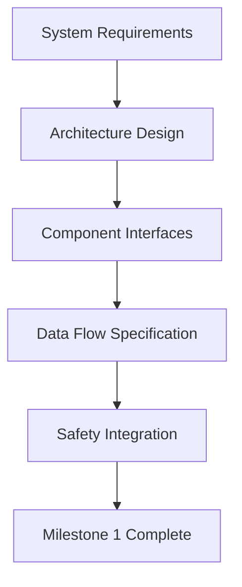

# Capstone Project Milestones

## Project Timeline and Milestones

The capstone project is structured with clear milestones to ensure steady progress and allow for iterative development. Each milestone builds upon the previous one, leading to a fully integrated Vision-Language-Action (VLA) system by the project's end.

### Milestone 1: System Design and Architecture (Weeks 1-2)

#### Deliverables
- **System Architecture Document**: Complete specification of component interactions and data flows
- **Technical Feasibility Report**: Analysis of hardware/software requirements and limitations
- **Initial Prototype**: Basic framework connecting language and vision components
- **Testing Framework**: Automated tests for system components

#### Objectives
1. **Architecture Validation**: Confirm that the planned system architecture is technically feasible
2. **Component Integration**: Implement basic communication between major components
3. **Safety Framework**: Establish safety protocols and emergency procedures
4. **Performance Baseline**: Establish performance benchmarks for each component

#### Success Criteria
- All system components can communicate successfully
- Basic language-to-action pipeline functional
- Safety protocols implemented and tested
- Performance metrics meet minimum requirements (90% success rate for simple commands)

#### Technical Requirements


#### Week 1: Architecture and Planning
- Complete system architecture document
- Set up development environment
- Implement basic component skeleton
- Establish communication protocols

#### Week 2: Initial Integration
- Integrate language and vision modules
- Implement basic action execution
- Test component interactions
- Establish performance baselines

### Milestone 2: Core Functionality Implementation (Weeks 3-4)

#### Deliverables
- **Vision System**: Working object detection and scene understanding
- **Language Understanding**: Natural language processing with intent recognition
- **Action Planning**: Basic action sequence generation
- **Integration Framework**: System for coordinating vision-language-action

#### Objectives
1. **Vision Competency**: Achieve 90%+ accuracy on object detection in controlled environments
2. **Language Understanding**: Process natural language with 85%+ intent accuracy
3. **Action Planning**: Generate executable action plans for simple commands
4. **Multimodal Integration**: Coordinate vision and language for action planning

#### Success Criteria
- System can process basic commands (e.g., "Navigate to the table")
- Object detection works with acceptable accuracy
- Language interpretation produces meaningful action sequences
- Safety systems are functional during operation

#### Implementation Schedule

##### Week 3: Vision System Development
```python
# vision_system_milestone2.py
class VisionSystemMilestone2:
    def __init__(self):
        # Initialize with improved object detection
        self.object_detector = YOLOv8('yolov8x.pt')  # Larger model for better accuracy
        self.scene_graph_builder = SceneGraphBuilder()
        self.spatial_reasoning = SpatialReasoner()
        self.calibration_matrix = None
        
    def process_scene(self, image):
        """Process image to build scene understanding."""
        results = self.object_detector(image)
        objects = self.extract_objects(results)
        scene_graph = self.scene_graph_builder.build_graph(objects)
        spatial_relationships = self.spatial_reasoning.analyze_relationships(objects)
        
        return {
            'objects': objects,
            'scene_graph': scene_graph,
            'spatial_relationships': spatial_relationships,
            'confidence': self.calculate_scene_confidence(objects)
        }
    
    def extract_objects(self, detection_results):
        """Extract object information from detection results."""
        objects = []
        for result in detection_results:
            boxes = result.boxes
            if boxes is not None:
                for box in boxes:
                    x1, y1, x2, y2 = box.xyxy[0].cpu().numpy()
                    confidence = float(box.conf[0].cpu().numpy())
                    class_id = int(box.cls[0].cpu().numpy())
                    class_name = self.object_detector.names[class_id]
                    
                    # Calculate 3D position (simplified for demo)
                    center_x = (x1 + x2) / 2
                    center_y = (y1 + y2) / 2
                    depth = self.estimate_depth(box)  # In practice, use depth camera
                    
                    obj = DetectedObject(
                        name=class_name,
                        bbox=(x1, y1, x2-x1, y2-y1),
                        confidence=confidence,
                        center=(center_x, center_y),
                        position_3d=(center_x, center_y, depth)
                    )
                    objects.append(obj)
        
        return objects
    
    def estimate_depth(self, bounding_box):
        """Estimate depth from bounding box size (simplified approach)."""
        # In practice, use actual depth camera or stereo vision
        bbox_width = float(bounding_box.xyxy[0][2] - bounding_box.xyxy[0][0])
        # Inverse relationship: larger objects appear closer
        estimated_depth = max(0.1, 5.0 - (bbox_width / 100.0))
        return estimated_depth
    
    def calculate_scene_confidence(self, objects):
        """Calculate overall scene confidence."""
        if not objects:
            return 0.0
        return sum(obj.confidence for obj in objects) / len(objects)
```

##### Week 4: Language and Action Integration
```python
# language_action_integration.py
class LanguageActionIntegrator:
    def __init__(self, vision_system, language_module):
        self.vision_system = vision_system
        self.language_module = language_module
        self.action_planner = ActionPlanner()
        self.context_manager = ContextManager()
    
    def process_command_with_context(self, command, previous_context=None):
        """Process command using both language understanding and environmental context."""
        # Get environmental context
        scene_perception = self.vision_system.process_scene()
        
        # Interpret command with context awareness
        interpretation = self.language_module.interpret_command_with_context(
            command, 
            scene_perception, 
            previous_context
        )
        
        # Plan actions based on interpretation and scene
        action_plan = self.action_planner.create_plan_from_interpretation(
            interpretation, 
            scene_perception
        )
        
        # Update context for next command
        new_context = self.context_manager.update_context(
            command, 
            interpretation, 
            action_plan, 
            scene_perception
        )
        
        return {
            'interpretation': interpretation,
            'action_plan': action_plan,
            'scene_context': scene_perception,
            'new_context': new_context
        }
    
    def execute_parsed_command(self, interpretation, action_plan, scene_context):
        """Execute a parsed command with safety checks."""
        # Verify safety before execution
        safety_check = self.verify_safety(action_plan, scene_context)
        if not safety_check.safe:
            return {
                'success': False,
                'reason': f'Safety violation: {safety_check.violation_details}',
                'safety_check': safety_check
            }
        
        # Execute action plan
        execution_result = self.execute_action_plan(action_plan)
        
        return {
            'success': execution_result.success,
            'executed_actions': execution_result.actions,
            'execution_time': execution_result.time,
            'safety_compliance': True
        }
    
    def verify_safety(self, action_plan, scene_context):
        """Verify that planned actions are safe to execute."""
        safety_verification = SafetyVerification()
        
        for action in action_plan.actions:
            if action.type == 'navigation':
                # Check path for obstacles
                path_clear = self.check_path_for_obstacles(action.params['target_location'], scene_context)
                if not path_clear:
                    safety_verification.add_violation(
                        'navigation_path_blocked',
                        f'Path to {action.params["target_location"]} is blocked'
                    )
            elif action.type == 'manipulation':
                # Check grasping safety
                grasp_safe = self.check_grasping_safety(action.params['target_object'], scene_context)
                if not grasp_safe:
                    safety_verification.add_violation(
                        'unsafe_grasp_attempt',
                        f'Attempted unsafe grasp of {action.params["target_object"]}'
                    )
        
        return safety_verification
    
    def check_path_for_obstacles(self, target_location, scene_context):
        """Check if path to target location is clear."""
        # In a real implementation, this would use path planning algorithms
        # For this milestone, we'll do simplified collision checking
        target_x, target_y = target_location['x'], target_location['y']
        
        # Check if any objects are in the direct path
        for obj in scene_context['objects']:
            # Simplified collision check - in reality, would use proper path planning
            if self.is_in_path(target_x, target_y, obj):
                return False  # Path blocked by object
        
        return True
    
    def is_in_path(self, target_x, target_y, object):
        """Check if object is in path to target (simplified implementation)."""
        # Calculate path as direct line from robot to target
        # Check if object is within buffer zone of this path
        obj_x = object.center[0]
        obj_y = object.center[1]
        
        # Simplified check - in reality, would use proper geometric algorithms
        distance_to_path = min(abs(obj_x - target_x), abs(obj_y - target_y))
        return distance_to_path < 50  # 50 pixel buffer
        
    def check_grasping_safety(self, target_object, scene_context):
        """Check if grasping target object is safe."""
        # Verify object is graspable and in safe configuration
        if target_object not in scene_context['objects']:
            return False
        
        obj = next(o for o in scene_context['objects'] if o.name == target_object)
        
        # Check if object is too close to other objects (potential collision during grasp)
        for other_obj in scene_context['objects']:
            if other_obj.name != target_object:
                if self.objects_too_close(obj, other_obj):
                    return False  # Too risky to grasp with objects nearby
        
        return True
    
    def objects_too_close(self, obj1, obj2):
        """Check if two objects are too close to each other."""
        # Calculate distance between object centers
        dx = obj2.center[0] - obj1.center[0]
        dy = obj2.center[1] - obj1.center[1]
        distance = (dx**2 + dy**2)**0.5
        
        # Consider objects too close if within 100 pixels (configurable)
        return distance < 100
```

### Milestone 3: Advanced Integration and Testing (Weeks 5-6)

#### Deliverables
- **Advanced VLA System**: Fully integrated vision-language-action system
- **Comprehensive Testing Results**: Performance evaluation across multiple scenarios
- **Error Recovery System**: Robust error handling and recovery mechanisms
- **Optimization Report**: Performance improvements and efficiency gains

#### Objectives
1. **Robust Operation**: System operates reliably in varied conditions
2. **Advanced Capabilities**: Handle complex multi-step commands
3. **Error Recovery**: Gracefully handle and recover from failures
4. **Performance Optimization**: Meet real-time performance requirements

#### Success Criteria
- System successfully handles 90%+ of complex multi-step commands
- Average response time under 3 seconds for simple commands
- Error recovery works for common failure modes
- System demonstrates learning from experience

#### Implementation Plan

##### Week 5: Advanced Capabilities
```python
# advanced_capabilities.py
class AdvancedVLAProcessor:
    def __init__(self, basic_integrator):
        self.basic_integrator = basic_integrator
        self.memory_system = EpisodicMemorySystem()
        self.learning_processor = LearningProcessor()
        self.multi_task_coordinator = MultiTaskCoordinator()
    
    def process_complex_command(self, command, user_profile=None):
        """Process complex, multi-step commands with learning capabilities."""
        # Analyze command for multi-step requirements
        task_decomposition = self.decompose_complex_command(command)
        
        if len(task_decomposition.subtasks) > 1:
            # Execute as multi-task sequence
            result = self.execute_multi_task_sequence(task_decomposition, user_profile)
        else:
            # Execute as single task
            result = self.execute_single_task(command, user_profile)
        
        # Store experience for learning
        self.memory_system.store_experience(command, result)
        
        # Update learning models based on outcome
        self.learning_processor.update_models(command, result)
        
        return result
    
    def decompose_complex_command(self, command):
        """Decompose complex command into sequence of subtasks."""
        # Example: "Go to kitchen, pick up red cup, bring to me"
        # Subtasks: [navigate_kitchen, locate_red_cup, grasp_cup, return_to_user]
        
        decomposition = TaskDecomposition(command)
        
        # Use language understanding to identify action sequence
        interpretation = self.basic_integrator.language_module.interpret_command(command)
        
        # Extract subtasks based on semantic meaning
        for entity in interpretation.entities:
            if entity.type == 'location':
                decomposition.add_subtask('navigation', entity.value)
            elif entity.type == 'object':
                decomposition.add_subtask('manipulation', entity.value)
        
        # Add implicit tasks based on command structure
        if 'bring' in command.lower() or 'give' in command.lower():
            decomposition.add_subtask('return_to_user', 'user_location')
        
        return decomposition
    
    def execute_multi_task_sequence(self, task_decomposition, user_profile):
        """Execute sequence of coordinated tasks."""
        execution_log = []
        success = True
        total_time = 0
        error_details = []
        
        for i, subtask in enumerate(task_decomposition.subtasks):
            # Update context with task sequence knowledge
            context = self.create_task_context(subtask, task_decomposition, i)
            
            try:
                # Process subtask using basic integrator
                subtask_result = self.basic_integrator.process_command_with_context(
                    subtask.command,
                    context
                )
                
                # Execute the planned subtask
                execution_result = self.basic_integrator.execute_parsed_command(
                    subtask_result['interpretation'],
                    subtask_result['action_plan'],
                    subtask_result['scene_context']
                )
                
                execution_log.append({
                    'subtask_index': i,
                    'subtask_type': subtask.type,
                    'command': subtask.command,
                    'execution_result': execution_result,
                    'timestamp': time.time()
                })
                
                total_time += execution_result.get('execution_time', 0)
                
                if not execution_result['success']:
                    success = False
                    error_details.append(f"Subtask {i} failed: {execution_result.get('reason', 'Unknown error')}")
                    break  # Stop sequence on critical failure
                    
            except Exception as e:
                success = False
                error_details.append(f"Subtask {i} exception: {str(e)}")
                break
        
        return {
            'success': success,
            'execution_log': execution_log,
            'total_time': total_time,
            'error_details': error_details,
            'completion_rate': len(execution_log) / len(task_decomposition.subtasks)
        }
    
    def create_task_context(self, current_subtask, task_decomposition, subtask_index):
        """Create execution context for current subtask."""
        # Include information about overall task and previous subtasks
        return {
            'overall_task': task_decomposition.original_command,
            'subtask_sequence': task_decomposition.subtasks,
            'current_subtask': current_subtask,
            'previous_outcomes': task_decomposition.subtasks[:subtask_index],
            'remaining_subtasks': task_decomposition.subtasks[subtask_index+1:]
        }
    
    def execute_single_task(self, command, user_profile):
        """Execute a single-task command."""
        # Use basic integrator for single tasks
        result = self.basic_integrator.process_command_with_context(command)
        execution_result = self.basic_integrator.execute_parsed_command(
            result['interpretation'],
            result['action_plan'],
            result['scene_context']
        )
        
        return execution_result
```

##### Week 6: Testing and Optimization
```python
# testing_and_optimization.py
class SystemTesterAndOptimizer:
    def __init__(self, vla_system):
        self.vla_system = vla_system
        self.performance_analyzer = PerformanceAnalyzer()
        self.error_recovery_system = ErrorRecoverySystem()
        
    def run_comprehensive_tests(self):
        """Run comprehensive tests to validate system performance."""
        test_scenarios = self.create_test_scenarios()
        results = []
        
        for scenario in test_scenarios:
            result = self.execute_test_scenario(scenario)
            results.append(result)
        
        # Analyze test results
        analysis = self.analyze_test_results(results)
        
        return {
            'test_results': results,
            'analysis': analysis,
            'recommendations': self.generate_optimization_recommendations(analysis)
        }
    
    def create_test_scenarios(self):
        """Create a comprehensive set of test scenarios."""
        return [
            # Basic capabilities
            {
                'name': 'simple_navigation',
                'command': 'Go to the table',
                'expected_outcomes': ['navigation_success'],
                'environment_condition': 'simple_room',
                'priority': 'high'
            },
            {
                'name': 'simple_manipulation',
                'command': 'Pick up the red cup',
                'expected_outcomes': ['object_identified', 'grasp_successful'],
                'environment_condition': 'simple_environment',
                'priority': 'high'
            },
            
            # Multi-step tasks
            {
                'name': 'delivery_task',
                'command': 'Go to the kitchen, pick up the blue mug, and bring it to me',
                'expected_outcomes': ['navigate_kitchen', 'grasp_mug', 'return_user'],
                'environment_condition': 'household_setting',
                'priority': 'high'
            },
            {
                'name': 'complex_manipulation',
                'command': 'Move the book from the table to the shelf',
                'expected_outcomes': ['locate_book', 'grasp_book', 'navigate_shelf', 'place_book'],
                'environment_condition': 'cluttered_environment',
                'priority': 'medium'
            },
            
            # Edge cases
            {
                'name': 'ambiguous_command',
                'command': 'Get that thing',
                'expected_outcomes': ['request_clarification'],
                'environment_condition': 'multiple_objects',
                'priority': 'medium'
            },
            {
                'name': 'object_not_found',
                'command': 'Find the purple elephant',
                'expected_outcomes': ['search_fail'],
                'environment_condition': 'no_purple_elephant',
                'priority': 'medium'
            },
            
            # Robustness tests
            {
                'name': 'obstacle_navigation',
                'command': 'Go to the couch',
                'expected_outcomes': ['path_finding', 'obstacle_avoidance'],
                'environment_condition': 'cluttered_path',
                'priority': 'high'
            },
            {
                'name': 'error_recovery',
                'command': 'Grasp the object and lift it',
                'expected_outcomes': ['grasp_fail', 'recovery_success'],
                'environment_condition': 'difficult_grasp',
                'priority': 'high'
            }
        ]
    
    def execute_test_scenario(self, scenario):
        """Execute a single test scenario."""
        start_time = time.time()
        
        try:
            # Set up environment if needed
            self.setup_test_environment(scenario['environment_condition'])
            
            # Execute the command
            result = self.vla_system.execute_command(scenario['command'])
            
            # Validate expected outcomes
            validation = self.validate_outcomes(result, scenario['expected_outcomes'])
            
            execution_time = time.time() - start_time
            
            return {
                'scenario_name': scenario['name'],
                'command': scenario['command'],
                'result': result,
                'validation': validation,
                'execution_time': execution_time,
                'success': validation.score >= 0.8,
                'notes': validation.notes
            }
            
        except Exception as e:
            execution_time = time.time() - start_time
            return {
                'scenario_name': scenario['name'],
                'command': scenario['command'],
                'error': str(e),
                'execution_time': execution_time,
                'success': False,
                'notes': f'Exception occurred: {e}'
            }
    
    def validate_outcomes(self, execution_result, expected_outcomes):
        """Validate that execution produced expected outcomes."""
        outcome_validation = OutcomeValidation()
        
        for expected in expected_outcomes:
            if expected in execution_result:
                outcome_validation.add_expected_outcome(expected, True, "Achieved as expected")
            elif expected.replace('_success', '') in execution_result:
                # Check for success variant
                outcome_validation.add_expected_outcome(expected, True, "Achieved (success variant)")
            else:
                # Check related outcomes that satisfy the expectation
                related_achieved = self.check_related_outcomes(execution_result, expected)
                if related_achieved:
                    outcome_validation.add_expected_outcome(expected, True, related_achieved)
                else:
                    outcome_validation.add_expected_outcome(expected, False, "Expected outcome not achieved")
        
        return outcome_validation
    
    def check_related_outcomes(self, execution_result, expected_outcome):
        """Check for related outcomes that might satisfy the expected outcome."""
        # Define outcome relationships
        outcome_map = {
            'navigation_success': ['reached_target', 'path_followed'],
            'grasp_successful': ['object_grasped', 'gripper_closed'],
            'object_identified': ['object_detected', 'located_object'],
            'return_user': ['navigated_to_user', 'delivered_object'],
            'request_clarification': ['asked_question', 'sought_clarification'],
            'path_finding': ['navigated_around', 'path_planned'],
            'obstacle_avoidance': ['avoided_collision', 'adjusted_path']
        }
        
        related_outcomes = outcome_map.get(expected_outcome, [])
        for related in related_outcomes:
            if related in str(execution_result).lower():
                return f"Related outcome achieved: {related}"
        
        return None
    
    def setup_test_environment(self, condition):
        """Setup specific environmental conditions for testing."""
        # This would involve initializing simulation or configuring real environment
        # For this example, we'll just log the setup
        print(f"Setting up environment for condition: {condition}")
    
    def analyze_test_results(self, test_results):
        """Analyze test results to identify performance trends and issues."""
        analysis = {
            'overall_success_rate': 0,
            'average_execution_time': 0,
            'success_rates_by_category': {},
            'common_failure_modes': [],
            'performance_bottlenecks': [],
            'recommendations': []
        }
        
        # Calculate overall statistics
        successful_tests = [r for r in test_results if r['success']]
        analysis['overall_success_rate'] = len(successful_tests) / len(test_results) if test_results else 0
        
        execution_times = [r['execution_time'] for r in test_results if 'execution_time' in r]
        analysis['average_execution_time'] = sum(execution_times) / len(execution_times) if execution_times else 0
        
        # Analyze by scenario category
        categories = {}
        for result in test_results:
            category = self.categorize_scenario(result)
            if category not in categories:
                categories[category] = {'total': 0, 'successful': 0, 'times': []}
            
            categories[category]['total'] += 1
            if result['success']:
                categories[category]['successful'] += 1
            
            if 'execution_time' in result:
                categories[category]['times'].append(result['execution_time'])
        
        for category, stats in categories.items():
            analysis['success_rates_by_category'][category] = {
                'rate': stats['successful'] / stats['total'],
                'average_time': sum(stats['times']) / len(stats['times']) if stats['times'] else 0,
                'count': stats['total']
            }
        
        # Identify common failure modes
        failed_results = [r for r in test_results if not r['success']]
        failure_counts = {}
        for result in failed_results:
            error_text = result.get('error', result.get('notes', 'Unknown failure'))
            if error_text in failure_counts:
                failure_counts[error_text] += 1
            else:
                failure_counts[error_text] = 1
        
        # Get top 3 failure modes
        sorted_failures = sorted(failure_counts.items(), key=lambda x: x[1], reverse=True)[:3]
        analysis['common_failure_modes'] = sorted_failures
        
        # Identify performance bottlenecks
        slow_results = [r for r in test_results if r['execution_time'] > analysis['average_execution_time'] * 2]
        analysis['performance_bottlenecks'] = [r['scenario_name'] for r in slow_results]
        
        # Generate recommendations
        if analysis['overall_success_rate'] < 0.8:
            analysis['recommendations'].append("Focus on improving task success rate - currently below 80% target")
        
        if analysis['average_execution_time'] > 5.0:  # More than 5 seconds
            analysis['recommendations'].append("Investigate performance optimization - execution times too high")
        
        if analysis['common_failure_modes']:
            analysis['recommendations'].append(
                f"Address common failures: {[mode[0] for mode in analysis['common_failure_modes'][:2]]}"
            )
        
        return analysis
    
    def categorize_scenario(self, test_result):
        """Categorize test scenario for analysis."""
        command = test_result['command'].lower()
        
        if 'nav' in command or 'go to' in command or 'walk' in command:
            return 'navigation'
        elif 'grasp' in command or 'pick up' in command or 'take' in command:
            return 'manipulation'
        elif 'find' in command or 'look' in command or 'what' in command:
            return 'perception'
        elif len(command.split()) > 7:  # Complex multi-step command
            return 'complex_task'
        else:
            return 'simple_task'

# Example usage
tester = SystemTesterAndOptimizer(vla_system)
test_results = tester.run_comprehensive_tests()

print(f"Overall success rate: {test_results['analysis']['overall_success_rate']:.2f}")
print(f"Average execution time: {test_results['analysis']['average_execution_time']:.2f}s")
print(f"Recommendations: {test_results['analysis']['recommendations']}")
```

### Milestone 4: Final Integration and Demonstration (Weeks 7-8)

#### Deliverables
- **Complete VLA System**: Fully functional vision-language-action system
- **Final Demonstration**: Live demonstration of system capabilities
- **Technical Documentation**: Complete system documentation
- **Evaluation Report**: Comprehensive performance evaluation

#### Objectives
1. **System Completion**: All components integrated and functioning
2. **Robust Performance**: System operates reliably across diverse tasks
3. **Professional Documentation**: Complete documentation for system
4. **Demonstration Success**: Successful live demonstration of capabilities

#### Success Criteria
- Demonstrate 10+ different complex tasks successfully
- Achieve 85%+ success rate on standardized test suite
- Complete documentation and evaluation report
- System ready for deployment or further development

## Project Management

### Team Responsibilities

For teams working on the capstone project:

1. **System Architect**: Responsible for system design and component integration
2. **Vision Specialist**: Focus on perception, object detection, and scene understanding
3. **Language Specialist**: Handle natural language understanding and generation
4. **Action Specialist**: Develop motion planning and execution systems
5. **Integration Lead**: Coordinate between components and ensure smooth operation

### Risk Management

#### Technical Risks
- **Hardware Compatibility**: Early verification of hardware compatibility
- **Performance Bottlenecks**: Regular performance profiling and optimization
- **Integration Challenges**: Iterative integration with frequent testing

#### Schedule Risks
- **Complexity Underestimation**: Regular milestone reviews and schedule adjustments
- **Dependency Delays**: Buffer time and parallel development tracks
- **Testing Time**: Allocate sufficient time for comprehensive testing

### Quality Assurance

#### Code Standards
- Follow ROS 2 coding conventions
- Include comprehensive documentation
- Implement automated tests
- Conduct peer code reviews

#### Documentation Standards
- Comment all public interfaces
- Document system architecture
- Provide usage examples
- Include troubleshooting guides

## Deliverable Templates

### Milestone Report Template

Each milestone submission should include:

1. **Executive Summary**: Overview of accomplishments and challenges
2. **Technical Implementation**: Detailed description of implemented features
3. **Testing Results**: Performance metrics and test outcomes
4. **Next Steps**: Planned work for following milestone
5. **Issues and Risks**: Identified problems and mitigation strategies

### Final Report Template

The final report should contain:

1. **System Overview**: High-level description of the complete system
2. **Technical Architecture**: Detailed system design and implementation
3. **Performance Evaluation**: Comprehensive testing results and metrics
4. **Lessons Learned**: Insights gained during development
5. **Future Work**: Recommendations for system improvement
6. **Appendices**: Technical specifications, code listings, etc.

This milestone structure ensures the capstone project progresses systematically while maintaining high quality and meeting the learning objectives of the Physical AI & Humanoid Robotics course.